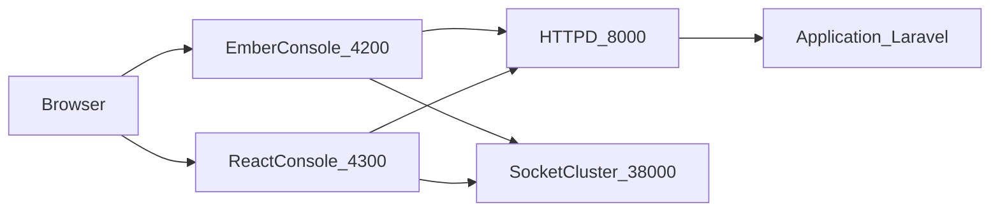

# React Migration Plan (Incremental, Same Backend)

## Goal
Build a new React frontend with feature parity to current Ember console, run both apps in parallel, then cut over safely without changing backend API contracts.

## Current Baseline
- Existing frontend is Ember in [`D:/fleetbase/console`](D:/fleetbase/console).
- React sidecar compose exists in [`D:/fleetbase/docker-compose.react-console.yml`](D:/fleetbase/docker-compose.react-console.yml) but source app path is missing.
- Backend already supports multi-frontend origins via [`D:/fleetbase/api/config/cors.php`](D:/fleetbase/api/config/cors.php).
- Runtime config contract to preserve is defined by [`D:/fleetbase/console/fleetbase.config.json`](D:/fleetbase/console/fleetbase.config.json) and loader logic in [`D:/fleetbase/console/app/utils/runtime-config.js`](D:/fleetbase/console/app/utils/runtime-config.js).
- Route and API migration inventory exists in [`D:/fleetbase/frontend_blue_print.txt`](D:/fleetbase/frontend_blue_print.txt).

## Target Architecture

## Phased Implementation

### Phase 1: Foundation and Parallel Runtime
- Create `react-console` app and container wiring to match existing compose expectation in [`D:/fleetbase/docker-compose.react-console.yml`](D:/fleetbase/docker-compose.react-console.yml).
- Implement runtime config bootstrap in React using the same JSON keys currently consumed by Ember (`API_HOST`, `API_NAMESPACE`, socket keys, OSRM, extensions).
- Add shared API client abstraction in React that mirrors current request style used in Ember services/controllers.
- Enable side-by-side local run (`4200` Ember, `4300` React) with backend CORS/stateful domain/socket origins updated via env (no backend code contract changes).

### Phase 2: App Shell and Cross-Cutting Services
- Build React equivalents for:
  - session/auth state handling,
  - route guards,
  - notifications/toast service,
  - i18n loading (locale packs matching [`D:/fleetbase/console/translations`](D:/fleetbase/console/translations)),
  - theme initialization behavior currently triggered in Ember application route.
- Establish a shared layout shell (sidebar/header/content) matching existing console UX.

### Phase 3: Feature-by-Feature Port (Pixel-Match)
- Port in high-value order using [`D:/fleetbase/frontend_blue_print.txt`](D:/fleetbase/frontend_blue_print.txt):
  1) auth flows (login/2FA/reset/verification),
  2) onboarding/install checks,
  3) console home + notifications,
  4) account/settings,
  5) admin/config modules,
  6) extension-driven virtual pages.
- For each module:
  - preserve route path and query semantics,
  - reuse identical backend endpoints,
  - validate response/data-shape parity before proceeding.

### Phase 4: Realtime + Extension Compatibility
- Recreate SocketCluster client lifecycle and subscription handling in React.
- Add extension host mechanism equivalent to Ember virtual/registry behavior (minimum: route mount + metadata-driven menu/actions).
- Verify dynamic page rendering parity for extension routes.

### Phase 5: Quality Gates and Cutover
- Define parity smoke suite from critical Ember flows (auth bootstrap, console home, admin config socket, onboarding).
- Add React build/test jobs in CI alongside Ember jobs (no removal yet).
- Cutover strategy:
  - canary users on React,
  - rollback to Ember by switching frontend entrypoint,
  - remove Ember only after stable period.

## Acceptance Criteria
- React app authenticates against existing backend with cookies/session and 2FA flow working.
- Core routes from Ember are reachable with matching behavior and payload expectations.
- Realtime features work in React with no origin/CORS errors.
- Production deploy supports safe rollback to Ember.
- No backend API contract changes required.

## Risks to Manage
- Sanctum/CORS/cookie domain mismatches across dual ports.
- Socket origin allowlist omissions causing silent realtime failures.
- Extension-driven dynamic routing parity complexity.
- CI/CD drift while two frontends coexist.

## Initial Deliverable (Sprint 1)
- Running React shell on `:4300` with:
  - runtime config loader,
  - API client,
  - login + protected route guard,
  - home page scaffold,
  - side-by-side operation with Ember untouched.