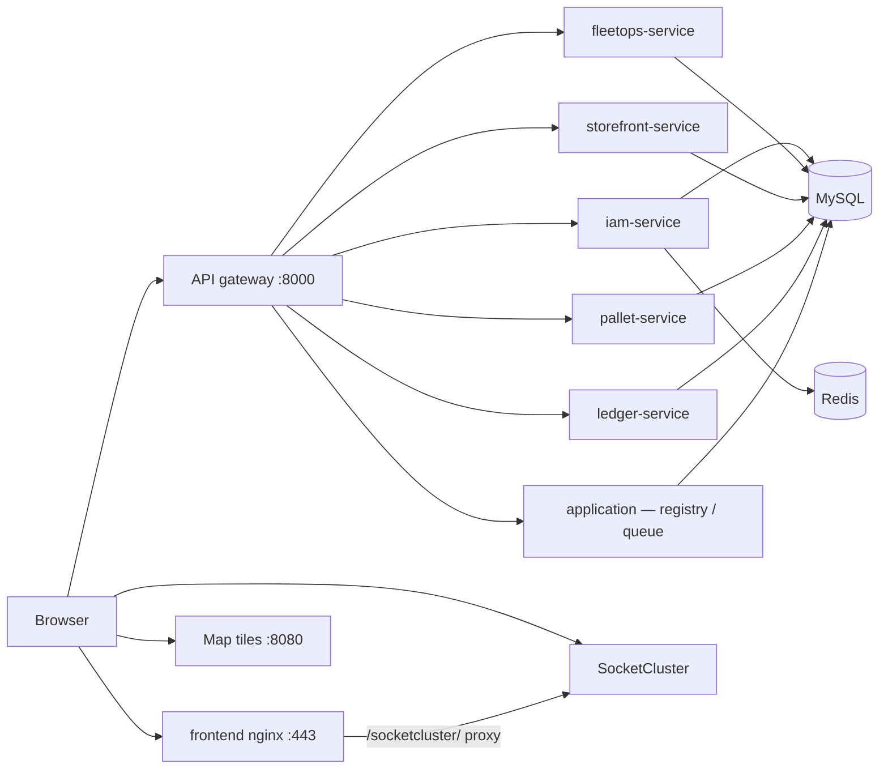

# shipgen-fleet — Production deployment

This document is the **production runbook** for deploying **shipgen-fleet** (React console + API gateway + domain services). For local development, see [docs/PRODUCTION-UI.md](docs/PRODUCTION-UI.md). For deeper frontend/nginx detail, see [frontend/docs/DEPLOYMENT.md](frontend/docs/DEPLOYMENT.md).

---

## Architecture (production)



| Layer | Service | Role |
|-------|---------|------|
| **UI** | `frontend` | Static React SPA; proxies WebSocket to SocketCluster |
| **API edge** | `gateway` | Path routing, CORS preflight, session → internal JWT |
| **IAM** | `iam-service` | Auth, users, orgs, settings, files, gateway introspection |
| **FleetOps** | `fleetops-service` | Orders, drivers, routes, vehicles, … (`/int/v1/*` non-IAM) |
| **Storefront** | `storefront-service` | `storefront/int/v1/*` |
| **Pallet** | `pallet-service` | `pallet/int/v1/*` |
| **Ledger** | `ledger-service` | `ledger/int/v1/*` |
| **Monolith slice** | `application` | Registry (`~registry/v1`), queue, scheduler |
| **Realtime** | `socket` | SocketCluster (host **38000** or proxied via UI) |
| **Maps** | `tiles` | Basemap on **8080** (dev proxy) or TileServer GL in prod |
| **Routing** | `osrm` / `osrm-backend` | Self-hosted OSRM (optional) |

**Public URLs (typical)**

| URL | Purpose |
|-----|---------|
| `https://app.yourdomain.com` | React console |
| `https://api.yourdomain.com` | API gateway (`VITE_API_HOST`) |
| `wss://app.yourdomain.com/socketcluster/` | Realtime (when using UI proxy) |

---

## Prerequisites

| Requirement | Notes |
|-------------|--------|
| Docker + Compose v2 | All API services use image `fleetbase-api-onprem:local` (build from repo) |
| TLS certificates | Terminate HTTPS at your reverse proxy or load balancer |
| MySQL 8 | Persistent volume; backup strategy required |
| Redis | Sessions, cache, queues |
| Secrets manager | Never commit production `api/.env` |

Optional: OSRM map data ([docker/osrm/README.md](docker/osrm/README.md)), SMTP, S3 for files, TileServer GL for map tiles.

---

## 1. Configure `api/.env`

Copy `api/.env.example` → `api/.env`. Minimum **production** values:

```env
APP_NAME=shipgen-fleet
APP_ENV=production
APP_DEBUG=false
APP_KEY=base64:GENERATE_WITH_artisan_key_generate
APP_URL=https://api.yourdomain.com

DB_CONNECTION=mysql
DB_HOST=database
DB_DATABASE=fleetbase
DB_USERNAME=root
DB_PASSWORD=STRONG_PASSWORD_HERE

CACHE_DRIVER=redis
QUEUE_CONNECTION=redis
SESSION_DRIVER=redis
REDIS_HOST=cache
BROADCAST_DRIVER=socketcluster

# CORS — exact React origin(s), scheme + host + port
CONSOLE_HOST=https://app.yourdomain.com
FRONTEND_HOSTS=https://app.yourdomain.com

# On-prem: disable Fleetbase cloud telemetry
TELEMETRY_DISABLED=true
REGISTRY_PREINSTALLED_EXTENSIONS=true

# Assets & maps (browser-reachable URLs)
ASSET_PUBLIC_BASE_URL=https://api.yourdomain.com
MAP_TILE_URL=https://tiles.yourdomain.com/styles/basic/{z}/{x}/{y}.png
MAP_TILE_URL_DARK=https://tiles.yourdomain.com/styles/basic/{z}/{x}/{y}.png
MAP_TILE_ATTRIBUTION=© OpenStreetMap contributors

# Routing (self-hosted OSRM recommended in production)
OSRM_HOST=http://osrm-backend:5000

# API gateway — CHANGE ALL SECRETS (openssl rand -hex 32)
GATEWAY_INTERNAL_SECRET=REPLACE_ME
GATEWAY_JWT_SECRET=REPLACE_ME
GATEWAY_JWT_ISSUER=shipgen-iam
GATEWAY_JWT_AUDIENCE=shipgen-internal
GATEWAY_JWT_TTL=900
GATEWAY_TRUST_INTERNAL_JWT=false
```

Generate `APP_KEY`:

```bash
docker compose run --rm application php artisan key:generate --show
```

**Per-service containers** (`iam-service`, `fleetops-service`, …) read the same `api/.env` via compose. Domain services need:

```env
GATEWAY_TRUST_INTERNAL_JWT=true
GATEWAY_JWT_SECRET=<same as above>
```

(Set in `docker-compose.yml` for `fleetops-service`, `pallet-service`, `ledger-service`, `storefront-service` — already wired for local stack.)

---

## 2. Build API image

Packages under `packages/*` are baked into the image at build time:

```bash
docker compose build application
```

After changing PHP packages in production, rebuild the image and redeploy all API containers (`iam-service`, `fleetops-service`, `application`, etc.).

---

## 3. Build React console

Vite **bakes** `VITE_*` at build time. Production `frontend/.env` (or Docker build args):

```env
VITE_API_HOST=https://api.yourdomain.com
VITE_API_NAMESPACE=int/v1

# Extension API mounts (defaults)
VITE_STOREFRONT_MODULE_ROOT=storefront/int/v1
VITE_LEDGER_MODULE_ROOT=ledger/int/v1
VITE_PALLET_MODULE_ROOT=pallet/int/v1
VITE_REGISTRY_MODULE_ROOT=~registry/v1

# Realtime — same origin as UI (recommended): nginx proxies /socketcluster/
VITE_SOCKETCLUSTER_PROXY=true

# Or direct SocketCluster (separate host/port):
# VITE_SOCKETCLUSTER_PROXY=false
# VITE_SOCKETCLUSTER_HOST=api.yourdomain.com
# VITE_SOCKETCLUSTER_PORT=443
# VITE_SOCKETCLUSTER_SECURE=true
# VITE_SOCKETCLUSTER_PATH=/socketcluster/

# Map tiles (public URL reachable from users' browsers)
VITE_MAP_TILE_URL=https://tiles.yourdomain.com/styles/basic/{z}/{x}/{y}.png
VITE_MAP_TILE_URL_DARK=https://tiles.yourdomain.com/styles/basic/{z}/{x}/{y}.png

# NEVER in production:
# VITE_FLEETOPS_PERMISSIVE=true
```

```bash
cd frontend
npm ci
npm run build
npm run verify:release
```

Docker build (matches compose defaults):

```bash
docker compose build frontend \
  --build-arg VITE_API_HOST=https://api.yourdomain.com \
  --build-arg VITE_SOCKETCLUSTER_PROXY=true \
  --build-arg VITE_MAP_TILE_URL=https://tiles.yourdomain.com/styles/basic/{z}/{x}/{y}.png
```

---

## 4. Production Docker Compose

### 4.1 Override file

Create `docker-compose.override.yml` (do not commit secrets):

```yaml
services:
  database:
    environment:
      MYSQL_ROOT_PASSWORD: "${MYSQL_ROOT_PASSWORD}"
      MYSQL_DATABASE: fleetbase

  gateway:
    environment:
      GATEWAY_INTERNAL_SECRET: "${GATEWAY_INTERNAL_SECRET}"

  application:
    environment:
      APP_ENV: production
      APP_DEBUG: "false"
      CONSOLE_HOST: https://app.yourdomain.com
      FRONTEND_HOSTS: https://app.yourdomain.com

  socket:
    environment:
      SOCKETCLUSTER_OPTIONS: '{"origins":"https://app.yourdomain.com:*"}'

  frontend:
    build:
      args:
        VITE_API_HOST: https://api.yourdomain.com
        VITE_SOCKETCLUSTER_PROXY: "true"
        VITE_MAP_TILE_URL: https://tiles.yourdomain.com/styles/basic/{z}/{x}/{y}.png
```

### 4.2 Start stack

```bash
docker compose pull   # base images only (socket, mysql, redis, nginx)
docker compose build application gateway frontend
docker compose up -d
```

First deploy / schema:

```bash
docker compose exec application php artisan migrate --force
# Optional seed / admin:
docker compose exec application php scripts/create-admin-user.php
```

### 4.3 Services to run in production

| Service | Required |
|---------|----------|
| `database`, `cache` | Yes |
| `gateway`, `iam-service`, `fleetops-service` | Yes |
| `storefront-service`, `pallet-service`, `ledger-service` | If modules used |
| `application` | Yes (registry, migrations, queue target) |
| `queue`, `scheduler` | Yes |
| `frontend`, `socket` | Yes |
| `tiles` | Yes unless external TileServer GL |
| `osrm`, `osrm-backend` | If route optimization / maps routing used |

---

## 5. Reverse proxy (TLS)

Terminate TLS in front of Docker published ports. Example **split domains**:

| Upstream | Target |
|----------|--------|
| `app.yourdomain.com` | `frontend:5173` (or static `dist/`) |
| `api.yourdomain.com` | `gateway:8000` |
| `tiles.yourdomain.com` | `tiles:8080` or TileServer GL |

**Single-domain** (optional): serve React at `/` and proxy `/int/`, `/ledger`, `/storefront/`, `/pallet/`, `/registry/`, `/~registry/` to `gateway:8000`, and `/socketcluster/` to SocketCluster or `frontend` (which proxies to `socket:8000`).

The gateway handles:

- IAM vs FleetOps path split on `/int/v1/*`
- CORS `OPTIONS` on protected routes
- Registry alias: `/registry/v1/*` → `~registry/v1/*`

See [docker/gateway/README.md](docker/gateway/README.md).

---

## 6. Post-deploy checklist

### Security

- [ ] `APP_DEBUG=false`, strong `APP_KEY`, `MYSQL_ROOT_PASSWORD` set
- [ ] `GATEWAY_INTERNAL_SECRET` and `GATEWAY_JWT_SECRET` rotated (not dev defaults)
- [ ] `FRONTEND_HOSTS` / `CONSOLE_HOST` match exact production UI URL
- [ ] `SOCKETCLUSTER_OPTIONS` origins restricted to your domain
- [ ] `VITE_FLEETOPS_PERMISSIVE` **unset** in production frontend build
- [ ] Secrets not in git; `.env` in `.gitignore`

### Functional

- [ ] `https://api.yourdomain.com/health` → 200
- [ ] Login at `https://app.yourdomain.com/auth`
- [ ] `/int/v1/users/me` returns user + company
- [ ] FleetOps: orders, drivers, routes load (no “There is nothing to see here.”)
- [ ] Storefront / Pallet / Ledger pages load via module paths
- [ ] Registry: extensions list (`~registry/v1` or `/registry/v1` via gateway)
- [ ] WebSocket: browser connects (101) to `/socketcluster/`
- [ ] Maps: tiles load (no failed requests to `:8080` or tile host)
- [ ] `docker compose ps` — `queue` healthy, workers running

### Smoke commands

```bash
curl -fsS https://api.yourdomain.com/health
docker compose exec application php artisan queue:status
docker compose logs --tail=50 gateway iam-service fleetops-service
```

---

## 7. Upgrading a release

```bash
git pull origin main

# Rebuild images after package or Dockerfile changes
docker compose build application gateway frontend

# Sync composer in running containers (dev/staging) OR rely on rebuilt image (prod)
# .\scripts\refresh-microservices.ps1 -Rebuild -RebuildFrontend

docker compose up -d

docker compose exec application php artisan migrate --force
docker compose exec application php artisan config:clear
docker compose exec application php artisan route:clear
```

PowerShell helper (local/staging):

```powershell
.\scripts\refresh-microservices.ps1 -Rebuild -RebuildFrontend
```

---

## 8. Troubleshooting

| Symptom | Cause | Fix |
|---------|--------|-----|
| CORS / blocked preflight | UI origin missing from `FRONTEND_HOSTS` | Add exact origin; restart API containers |
| `401` on FleetOps/Storefront API | Gateway auth failed | Check session/Bearer token; IAM `gateway/auth` logs |
| `500` on FleetOps API | Broken `vendor/fleetbase/core-api` or JWT mint | Run `composer update fleetbase/core-api`; verify `GATEWAY_JWT_*` |
| `400` “There is nothing to see here.” on `/int/v1/products` | Request hit wrong service | UI should use `storefront/int/v1` (module-first); rebuild frontend |
| Registry `400` on `/registry/v1` | Laravel uses `~registry` prefix | Use `VITE_REGISTRY_MODULE_ROOT=~registry/v1` or gateway rewrite |
| WebSocket fails | No proxy or wrong port | Enable `VITE_SOCKETCLUSTER_PROXY=true` + frontend nginx `/socketcluster/` |
| Map tiles missing | Nothing on tile URL | Run `tiles` service or external TileServer; set `MAP_TILE_URL` / `VITE_MAP_TILE_URL` |
| Stale code in containers | Image vendor not updated | Rebuild `application` image or `refresh-microservices.ps1` |

---

## 9. Related documentation

| Document | Content |
|----------|---------|
| [docs/PRODUCTION-UI.md](docs/PRODUCTION-UI.md) | React-only UI, local Docker ports |
| [docs/MICROSERVICES-ARCHITECTURE.md](docs/MICROSERVICES-ARCHITECTURE.md) | Service boundaries, migration plan |
| [docker/gateway/README.md](docker/gateway/README.md) | Gateway routes and env |
| [frontend/docs/DEPLOYMENT.md](frontend/docs/DEPLOYMENT.md) | Frontend build, nginx examples, E2E |
| [docker/tiles/README.md](docker/tiles/README.md) | Map tile server |
| [docker/osrm/README.md](docker/osrm/README.md) | OSRM setup |

---

## Component versions (this fork)

Track versions in `api/composer.json` / `packages/*/composer.json` when cutting a release:

| Package | Path |
|---------|------|
| core-api | `packages/core-api` |
| fleetops-api | `packages/fleetops/server` |
| storefront-api | `packages/storefront/server` |
| ledger-api | `packages/ledger/server` |
| pallet-api | `packages/pallet/server` |
| registry-bridge | `packages/registry-bridge/server` |

---

## Support

- Architecture and gateway: [docs/MICROSERVICES-ARCHITECTURE.md](docs/MICROSERVICES-ARCHITECTURE.md)
- Upstream Fleetbase: [GitHub Discussions](https://github.com/fleetbase/fleetbase/discussions)
