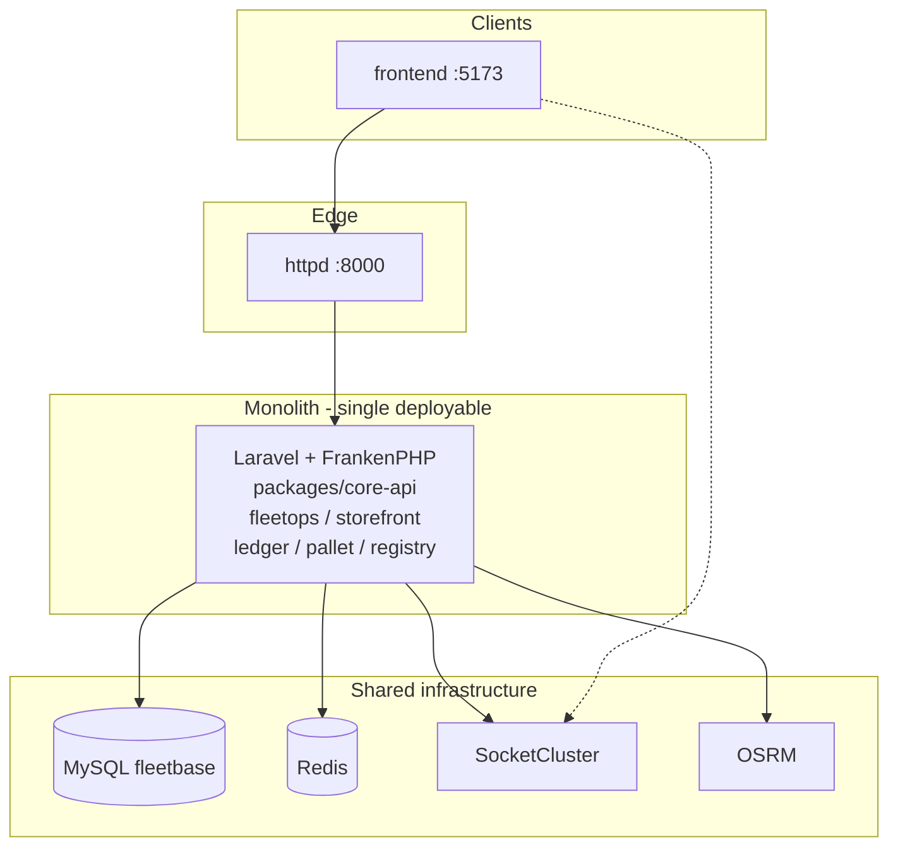
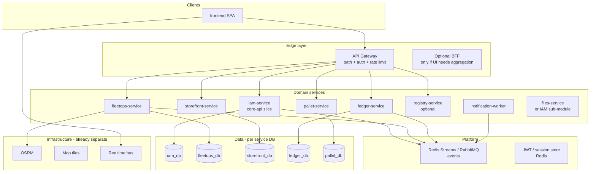

# shipgen-fleet — Microservices architecture & migration plan

**Status:** Target architecture (incremental migration from current modular monolith)  
**UI:** `frontend/` (React) only  
**Today:** One Laravel process (`application`) loads all `packages/*/server` modules against **one MySQL** database.

---

## 1. Current state (modular monolith)



**Why this is not microservices yet**

- All domains share **one process**, **one schema**, and **in-process** calls (Eloquent, shared `company_uuid` session).
- Queue workers and scheduler run the **same** image as the API.
- Breaking one package deploy risks the whole API.

---

## 2. Target architecture (bounded contexts)

Split along **existing packages** and **URL prefixes** the React app already uses.



### Service catalog

| Service | Source package | Public / internal API prefix | Own database | Extract priority |
|---------|----------------|------------------------------|--------------|------------------|
| **iam-service** | `core-api` (auth, users, companies, roles, files, settings, webhooks infra) | `/int/v1` (auth, users, orgs, settings) | `iam` | **P0** — every other service needs identity |
| **fleetops-service** | `fleetops` | `/int/v1/fleet-ops`, `/fleet-ops/v1` | `fleetops` | **P0** — core product |
| **notification-worker** | core + fleetops jobs | — (consumes queue) | — | **P1** — async mail, webhooks |
| **pallet-service** | `pallet` | `/pallet/int/v1` | `pallet` | **P1** — already isolated routes |
| **ledger-service** | `ledger` | `/ledger`, `/ledger/int/v1` | `ledger` | **P2** |
| **storefront-service** | `storefront` | `/storefront/int/v1` | `storefront` | **P2** |
| **registry-service** | `registry-bridge` | `/registry/v1` | `registry` | **P3** — optional if extensions preinstalled |
| **realtime-gateway** | SocketCluster (keep) | WebSocket | — | Keep as infra |
| **routing-service** | OSRM (keep) | HTTP | — | Keep as infra |

### API gateway routing (target)

| Request path | Upstream (target) |
|--------------|-------------------|
| `/int/v1/auth/*`, `/int/v1/users/*`, `/int/v1/companies/*`, `/int/v1/settings/*`, `/int/v1/files/*`, `/int/v1/roles/*`, `/int/v1/policies/*`, `/int/v1/groups/*` | **iam-service** |
| `/int/v1/fleet-ops/*`, `/fleet-ops/*` | **fleetops-service** |
| `/pallet/int/v1/*` | **pallet-service** |
| `/ledger/*` | **ledger-service** |
| `/storefront/*` | **storefront-service** |
| `/registry/*` | **registry-service** |
| `/health` | gateway or iam |

React env today (`frontend/src/lib/env.js`) already matches these prefixes — **the UI should keep calling the gateway host**; only the gateway upstreams change over time.

---

## 3. Cross-cutting decisions (decide before coding)

### 3.1 Authentication (chosen)

| Layer | Mechanism |
|-------|-----------|
| **Browser → gateway** | Existing **session / Sanctum cookie** (React unchanged) |
| **Gateway → IAM** | `GET /int/v1/gateway/auth` + `X-Gateway-Internal-Secret` (session introspection) |
| **Gateway → domain services** | Short-lived **internal JWT** in `X-Service-Authorization` (minted by IAM/monolith today) |
| **Extracted services** | `GATEWAY_TRUST_INTERNAL_JWT=true` — validate JWT, no shared PHP session |

Plain `X-User-Uuid` headers alone are **not** trusted from clients; the gateway strips spoofed headers and only forwards JWTs it minted after introspection.

Implementation: `Fleetbase\Support\InternalJwt`, `GatewayAuthController`, `docker/gateway/nginx.conf.template` (`auth_request`).

### 3.2 Data

| Phase | Approach |
|-------|----------|
| **2a** | **Schema-per-service** on one MySQL instance (logical split, same server) |
| **2b** | **Database-per-service** (physical split) |
| **3** | Remove cross-DB FKs; use **IDs + events** only |

Shared tables today: `companies`, `users`, `company_users`, `files`, `permissions` — owned by **IAM**. FleetOps references `company_uuid`, `user_uuid` — must become **API validation**, not FK.

### 3.3 Communication

| Pattern | Use for |
|---------|---------|
| **Sync HTTP** | Reads, commands that need immediate UI feedback |
| **Async events** | `OrderCreated`, `InvoicePaid`, webhook dispatch, notifications |
| **No distributed monolith** | Avoid fleetops calling ledger via HTTP for every read — use events + local read models where needed |

**Recommendation:** Redis Streams or RabbitMQ; you already use **Redis** for queues.

### 3.4 Files & realtime

- **Files:** stay with IAM or dedicated `files-service` (S3/MinIO); other services store `file_uuid` only.
- **SocketCluster:** channel naming by `company_uuid`; publishers in fleetops/iam emit after DB commit.

---

## 4. Migration phases (strangler fig)

Do **not** big-bang rewrite. Each phase keeps production working.

### Phase 0 — Gateway in front of monolith (1–2 weeks)

**Goal:** Single public URL; routes defined; all traffic still hits monolith.

- Add **API gateway** (`docker/gateway/`) — see [docker/gateway/README.md](../docker/gateway/README.md).
- Point `VITE_API_HOST` at gateway (still port 8000).
- Add correlation ID header (`X-Request-Id`) and structured logs.

**Exit criteria:** React works unchanged; gateway access logs show path breakdown.

### Phase 1 — Extract IAM (in progress)

**Goal:** `iam-service` owns auth/session/users/companies; monolith runs domain modules only.

**Done in repo:**

1. `iam-service` container (`FLEETBASE_SERVICE=iam`) — IAM routes only in `packages/core-api/src/routes.php`.
2. `application` container (`FLEETBASE_SERVICE=monolith`) — skips IAM internal routes.
3. Gateway routes `/int/v1/(auth|users|…)` → `iam-service`; `auth_request` introspection → IAM.
4. **Redis sessions** shared between IAM and monolith (`SESSION_DRIVER=redis`).

**Still to do:**

- Database: logical `iam` schema split (optional Phase 2a).
- Slim IAM image (composer only `core-api`, no fleetops providers).

**Exit criteria:** Login, org switch, IAM CRUD work via gateway → iam-service; fleetops on monolith.

### Phase 2 — Extract FleetOps (in progress)

**Goal:** `fleetops-service` owns fleet-ops HTTP API; monolith keeps other domains + workers.

**Done in repo:**

1. `fleetops-service` container (`FLEETBASE_SERVICE=fleetops`, `GATEWAY_TRUST_INTERNAL_JWT=true`).
2. `application` (`monolith`) — FleetOps **routes** disabled; schedules/queue jobs still run here.
3. Gateway `/int/v1/fleet-ops`, `/fleet-ops` → `fleetops-service` with internal JWT.
4. `ServiceMode` helper gates routes per package (see `packages/core-api/src/Support/ServiceMode.php`).

**Still to do:**

- `fleetops_db` schema split; IAM user lookup HTTP client.
- Dedicated fleetops queue workers (optional).

**Exit criteria:** Orders, drivers, maps UI work via gateway → fleetops-service.

See [services/fleetops/README.md](../services/fleetops/README.md).

### Phase 3 — Domain services (Pallet, Ledger, Storefront)

| Service | Container | Gateway path |
|---------|-----------|--------------|
| Pallet | `pallet-service` | `/pallet/` |
| Ledger | `ledger-service` | `/ledger` |
| Storefront | `storefront-service` | `/storefront/` |

**Monolith (`application`)** now serves **registry** only (+ queue/scheduler). See `services/*/README.md`.

### Phase 4 — Event bus & read models (ongoing)

- Publish domain events from each service.
- Notification worker subscribes; no direct DB peek across services.
- Optional: CQRS read DB for dashboards.

---

## 5. Repository layout (target)

```
fleetbase/                          # mono-repo (optional)
├── frontend/                       # SPA (unchanged)
├── services/
│   ├── iam/                        # Laravel app, composer: core-api only
│   ├── fleetops/
│   ├── pallet/
│   ├── ledger/
│   └── storefront/
├── packages/                       # shared PHP libs (DTOs, contracts)
│   └── contracts/                  # OrderCreated, UserSnapshot, etc.
├── docker/
│   ├── gateway/
│   └── compose/
│       ├── docker-compose.yml      # dev monolith (current)
│       └── docker-compose.ms.yml   # gateway + services
└── docs/
    └── MICROSERVICES-ARCHITECTURE.md
```

You can also use **one repo per service** later; start mono-repo to reduce friction.

---

## 6. What to stop doing in microservices world

| Anti-pattern | Replacement |
|--------------|-------------|
| `StorefrontServiceProvider` registering `FleetOpsServiceProvider` | HTTP or events between services |
| Shared `fleetbase` MySQL with cross-table FKs | Service-owned schema + UUID references |
| Laravel session `company` in fleetops controllers | JWT claims or trusted headers from gateway |
| One `queue:work` for all jobs | Per-service workers + named queues |
| Direct Eloquent on IAM models from fleetops | IAM API or cached user snapshot |

---

## 7. React frontend impact

Minimal if gateway preserves paths:

| Env var | Phase 0–2 | Phase 3+ |
|---------|-----------|----------|
| `VITE_API_HOST` | `http://gateway:8000` | same |
| `VITE_API_NAMESPACE` | `int/v1` | same |
| `VITE_*_MODULE_ROOT` | unchanged | unchanged |

Optional later: single GraphQL/BFF — only if aggregation latency hurts; not required initially.

---

## 8. First implementation tasks (recommended order)

1. [x] Approve service boundaries (table in §2).
2. [x] Auth strategy (§3.1) — session at gateway + internal JWT between services.
3. [x] Phase 0 gateway enabled in [docker-compose.yml](../docker-compose.yml) ([docker/gateway/README.md](../docker/gateway/README.md)).
4. [ ] Document OpenAPI per prefix from current monolith (export baseline).
5. [ ] Create `packages/contracts` for event payloads + shared DTOs.
6. [x] `iam-service` container + gateway upstream (see [services/iam/README.md](../services/iam/README.md)).
7. [ ] Split MySQL schemas (`iam`, `fleetops`) on same server.
8. [x] Extract fleetops-service; gateway `/int/v1/fleet-ops` → fleetops-service.

---

## 9. Related docs

- [PRODUCTION-UI.md](./PRODUCTION-UI.md) — current deploy
- [EXTERNAL-DEPENDENCIES-AND-OWNERSHIP-AUDIT.md](./EXTERNAL-DEPENDENCIES-AND-OWNERSHIP-AUDIT.md) — outbound deps per module
- [frontend/docs/DEPLOYMENT.md](../frontend/docs/DEPLOYMENT.md) — React deploy

---

## 10. Summary

| Question | Answer |
|----------|--------|
| Can we jump straight to 8 microservices? | **No** — high risk; use strangler phases. |
| What splits naturally? | **IAM, FleetOps, Pallet, Ledger, Storefront** — already separate route prefixes. |
| What stays infrastructure? | **MySQL/Redis (then per-DB), SocketCluster, OSRM, map tiles**. |
| What does React change? | **Almost nothing** if gateway keeps URLs stable. |
| First code step? | **API gateway** routing to existing monolith (Phase 0). |
