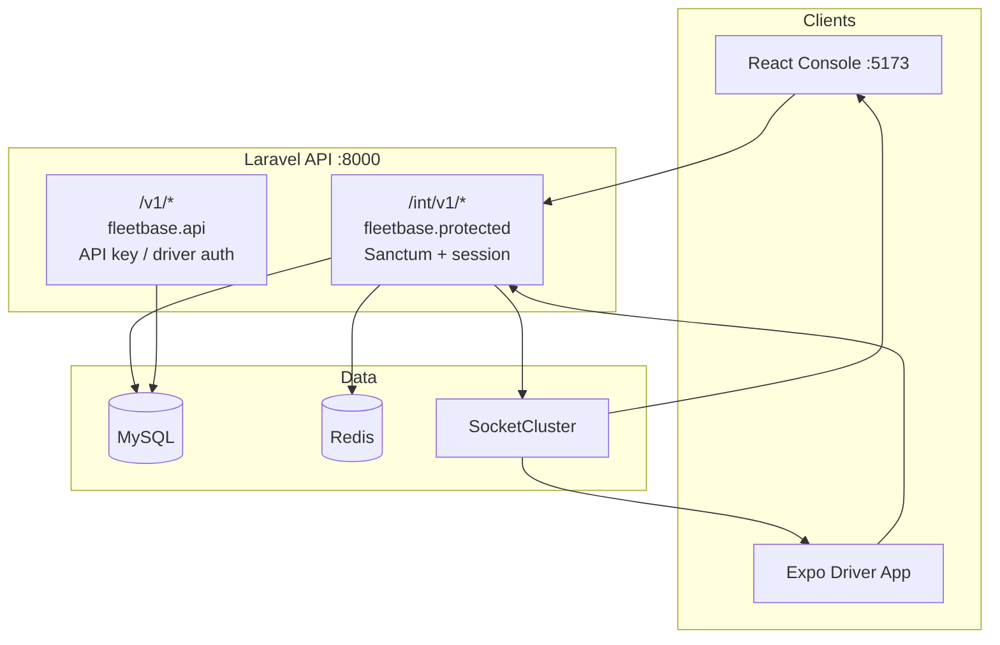
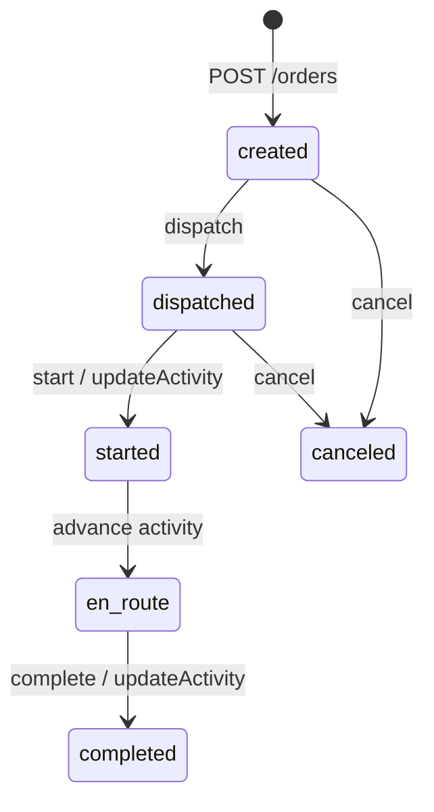

# FleetOps Day 4 — End-to-End Application Guide

> **Sources:** `documents/BACKEND-LOW-LEVEL-REQUIREMENTS.md` (Parts IV-B, IV-C, VII-B, VII-G) and `documents/LOW-LEVEL-REQUIREMENTS.md` (FLEETOPS-ORDERS, platform runtime).  
> **Implementations:** React console (`frontend/`), Expo driver app (`fleet_mobile-main/frontend/`), Laravel API (`api/` + `packages/*`).

This document describes the **full manual and technical flow** from dispatcher console → driver mobile → console realtime verification.

---

## 1. System overview

Fleetbase is a modular logistics platform. Day 4 focuses on **FleetOps orders** executed by a **dispatcher (console)** and a **driver (mobile)** against the same backend.



| Component | Role | Default URL |
|-----------|------|-------------|
| **API** | Source of truth for orders, drivers, workflow | `http://<host>:8000` |
| **Internal API** | Console + driver app (session token) | `/int/v1/...` |
| **Consumable API** | Navigator/SDK (API key or dedicated driver routes) | `/v1/...` |
| **React console** | Create, dispatch, monitor, realtime | `http://<host>:5173` |
| **Expo mobile** | Assigned orders, start trip, advance, complete, POD | Same API as `/int/v1` |
| **SocketCluster** | Live order/company/driver updates | Port `8000`, path `/socketcluster/` |

---

## 2. Actors and accounts

| Actor | Login | Used on | Typical permissions |
|-------|--------|---------|---------------------|
| **Dispatcher / admin** | Email + password (Sanctum) | Console | `fleet-ops create/dispatch/view order`, assign driver |
| **Driver** | Email + password of user **linked to Driver record** | Mobile app | Sees assigned orders; runs field workflow |
| **API integrator** | API key (Basic) | `/v1/*` only | Programmatic access |

**Critical rule:** The mobile user must be the **same identity** as the driver assigned on the order (`driver_assigned_uuid` → `drivers.user_uuid`).

---

## 3. API tiers (read this before integrating)

From **BACKEND LLRD Part 0 & IV-B**:

### 3.1 Internal console API — `/int/v1/orders`

Middleware: `fleetbase.protected` (Bearer token + `X-Company` header).

| Operation | Method | Path pattern | Notes |
|-----------|--------|--------------|-------|
| List | GET | `/orders` | Paginated; use `?limit=500` for driver lists |
| Detail | GET | `/orders/{uuid\|public_id}` | Both id forms work |
| Create | POST | `/orders` | Body `{ order: { ... } }` |
| Update | PATCH | `/orders/{id}` | Assign: `driver_assigned_uuid` |
| Dispatch (bulk) | PATCH | `/orders/dispatch` | Body `{ order_uuid }` or `{ orders: [uuid] }` |
| Dispatch (single) | PATCH/POST | `/orders/{id}/dispatch` | May 404 on some builds; prefer bulk PATCH |
| **Start** | PATCH | `/orders/start` | Body `{ order: "<uuid>" }` — **not** `POST /orders/{id}/start` |
| Next activity | GET | `/orders/next-activity/{id}` | Returns activity object(s) |
| **Advance workflow** | PATCH | `/orders/update-activity/{id}` | Body `{ activity: { code, ... } }` |
| Cancel | PATCH | `/orders/cancel` | Body with order id(s) |
| Default config | GET | `/orders/default-config` | Required for create |

### 3.2 Consumable field API — `/v1/orders`

Middleware: `fleetbase.api` (API credentials). Intended for **Navigator** and SDK.

| Operation | Method | Path |
|-----------|--------|------|
| Start | POST | `/v1/orders/{id}/start` |
| Next activity | GET | `/v1/orders/{id}/next-activity` |
| Update activity | POST/PATCH | `/v1/orders/{id}/update-activity` |
| Complete | POST | `/v1/orders/{id}/complete` |
| POD | POST | `/v1/orders/{id}/capture-signature` (etc.) |
| Track GPS | POST/PATCH | `/v1/drivers/{id}/track` |

**Expo app today** uses **`/int/v1`** (session login like console). Workflow calls must use **internal path shapes** above, not consumable `{id}/start` URLs.

---

## 4. Order lifecycle (domain)

From **BACKEND LLRD Part IV-B & IV-C** and **console LLR FLEETOPS-ORDERS**.

### 4.1 Configuration layer

Every order references an **`order_config`** (`order_config_uuid`). The config’s **`flow`** JSON defines:

- Activity codes: `created`, `dispatched`, `started`, `completed`, `canceled`, plus custom steps
- Transitions, logic (`and`/`or` conditions), and Laravel events

Runtime: `Fleetbase\FleetOps\Flow\Flow`, `Activity`, `OrderConfig::nextActivity()`.

### 4.2 Typical state progression



Actual edges come from **your** `order_config.flow`. Use `GET /orders/next-activity/{id}` for the next step at runtime.

### 4.3 Phase map (who does what)

| Phase | Status (typical) | Console (dispatcher) | Mobile (driver) | Backend |
|-------|------------------|----------------------|-----------------|---------|
| A — Plan | `created` | Create order, places, payload, assign driver | — | `POST /orders` |
| B — Release | `dispatched` | Dispatch (workflow or bulk) | See order in **Assigned** | `dispatch`, `OrderDispatched` |
| C — Execute | `started` / `en_route` | Monitor map + activity | **Start trip**, **Advance** | `PATCH start` or `update-activity` |
| D — Proof | varies | View proofs tab | Signature / photo / QR | POD endpoints |
| E — Close | `completed` | Timeline + status | **Complete** | `update-activity` (complete flag) or `complete` |
| F — Cancel | `canceled` | Cancel action | — | `cancel` |

---

## 5. Console end-to-end (React app)

From **LOW-LEVEL-REQUIREMENTS — FLEETOPS-ORDERS** (journeys J-D1–J-D4).

### 5.1 Prerequisites

- API running on port **8000**
- Console: `cd frontend && npm run dev -- --host`
- Env: `VITE_API_HOST`, `VITE_API_NAMESPACE=int/v1`
- User with permissions: `fleet-ops create order`, `dispatch order`, `view order`
- At least **2 places**, **1 driver** (with user account), **default order config**

### 5.2 Journey J-D4 — Create order

| Step | UI | API |
|------|-----|-----|
| 1 | FleetOps → Operations → Orders → **New order** (`/fleet-ops/operations/orders/new` or modal) | — |
| 2 | **Details:** type/config, customer, internal ID | — |
| 3 | **Route:** pickup + dropoff places | `payload.pickup_uuid`, `dropoff_uuid` |
| 4 | **Payload:** line items (optional) | `entities[]` |
| 5 | **Assignments:** select driver; optional “Dispatch immediately” | `driver_assigned_uuid` |
| 6 | Save | `POST /int/v1/orders` |

**Success:** Order in list with status **`created`** (unless dispatch-on-create checked).

### 5.3 Assign driver (if not done on create)

| Step | UI | API |
|------|-----|-----|
| 1 | Open order drawer/detail | `GET /orders/{id}` |
| 2 | **Assign driver** (header menu) | `PATCH /orders/{id}` `{ driver_assigned_uuid }` |

### 5.4 Journey J-D2 — Dispatch

| Step | UI | API |
|------|-----|-----|
| 1 | Select order(s) or open detail | — |
| 2 | **Dispatch** → confirm modal | `PATCH /orders/dispatch` or `.../dispatch` |
| 3 | Toast + list refresh | Status → **`dispatched`** |

**Permission:** `fleet-ops dispatch order`

### 5.5 Monitor (J-D1 + realtime)

| Step | UI | Mechanism |
|------|-----|-----------|
| 1 | Keep order drawer open or reopen from list | — |
| 2 | **Activity** tab / timeline | HTTP + **SocketCluster** channel `order.{uuid}` |
| 3 | Map on detail | Driver position if tracking active |
| 4 | Events | `order.updated`, `order.completed`, `waypoint.activity` (LLR §8) |

**Channel (BACKEND VII-G):** `order.{order_uuid}` — subscribe on detail enter, unsubscribe on leave.

---

## 6. Mobile end-to-end (Expo driver app)

### 6.1 Configuration

```bash
cd fleet_mobile-main/frontend
# .env or app config
EXPO_PUBLIC_API_BASE_URL=http://<LAN-IP>:8000/int/v1
npm start
```

- Physical device: **same Wi‑Fi** as API; use LAN IP, not `localhost`
- CORS: API `FRONTEND_HOSTS` must allow console origin (mobile uses direct API URL)

### 6.2 Authentication

| Step | App screen | API |
|------|------------|-----|
| 1 | Login | `POST /auth/login` `{ identity, password }` |
| 2 | Bootstrap | `GET /users/me`, `GET /auth/organizations` |
| 3 | Store token + org | Headers: `Authorization: Bearer`, `X-Company` |

### 6.3 Orders list

| Tab | Shows orders with status |
|-----|--------------------------|
| **Assigned** | `created`, `dispatched`, `assigned`, `scheduled` |
| **Active** | `started`, `en_route`, `arrived`, `delivered`, … |
| **Completed** | `completed`, `canceled` |

API: `GET /orders?limit=500` — map with `orderMapper`.

### 6.4 Receive dispatched order (Phase B → C)

| Step | Action | Expected |
|------|--------|----------|
| 1 | **Assigned** tab → pull refresh | Order visible |
| 2 | Tap order | Detail: pickup, dropoff, status **dispatched** |
| 3 | — | If missing: wrong driver, not dispatched, or API URL |

### 6.5 Start trip (Phase C)

| Step | Action | API (internal) |
|------|--------|----------------|
| 1 | Tap **Start trip** | `GET /orders/next-activity/{uuid}` |
| 2 | App applies first activity | `PATCH /orders/update-activity/{uuid}` `{ activity: {...} }` |
| 3 | — | Status → **`started`** (or config-specific) |

**Do not use** `POST /orders/{id}/start` on `/int/v1` — returns *“There is nothing to see here.”* (404).

### 6.6 Advance activities (Phase C)

| Step | Action | API |
|------|--------|-----|
| 1 | Tap **Advance: …** when enabled | Same as above with next activity from `next-activity` |
| 2 | Repeat | Until **Complete** is allowed |

### 6.7 Complete (Phase E)

| Step | Action | API |
|------|--------|-----|
| 1 | Tap **Complete** | `GET next-activity` → find `complete: true` → `PATCH update-activity` |
| 2 | — | Status **`completed`**; moves to **Completed** tab |

### 6.8 Proof of delivery (optional)

If `pod_required` on order (LLR create form §5.2):

| Button | Consumable path (if wired) | Internal |
|--------|---------------------------|----------|
| Signature | `POST .../capture-signature` | May require `/v1` + API key |
| Photo | `POST .../capture-photo` | Same |
| QR | `POST .../capture-qr` | Same |

POD on `/int/v1` may differ by deployment — verify Part X in BACKEND LLRD.

### 6.9 Tracking (optional)

- Mobile **Track live** tab → `POST /orders/{id}/track` (location ingest)
- Console map updates via sockets + positions API

---

## 7. Full Day 4 manual E2E checklist

Use this table for a single test run (fill in your IDs).

| # | Step | Where | Pass? | Notes |
|---|------|-------|-------|-------|
| 0 | API + console + Expo running | Dev machines | ☐ | |
| 1 | Create order | Console | ☐ | Internal ID: ________ |
| 2 | Assign driver | Console | ☐ | Driver email: ________ |
| 3 | Dispatch | Console | ☐ | Status = dispatched |
| 4 | Login as driver | Mobile | ☐ | |
| 5 | See order (Assigned) | Mobile | ☐ | |
| 6 | Start trip | Mobile | ☐ | Status = started/en_route |
| 7 | Advance (if shown) | Mobile | ☐ | |
| 8 | Complete | Mobile | ☐ | Status = completed |
| 9 | Timeline updates | Console | ☐ | Without full page reload |
| 10 | Status badge completed | Console | ☐ | |
| 11 | WebSocket connected | Console DevTools | ☐ | |

**CLI helper (console machine):**

```bash
cd frontend
npm run e2e:manual:day4          # prep order via API
node scripts/day4-manual-e2e.mjs status <order-uuid>
npm run test:e2e:day4              # API contract tests
```

---

## 8. Permissions (authorization)

From **BACKEND LLRD Part VII-B** — format: `{service} {action} {resource}`.

| Action | Permission name |
|--------|-----------------|
| View list/detail | `fleet-ops view order` / `see order` / `list order` |
| Create | `fleet-ops create order` |
| Dispatch | `fleet-ops dispatch order` |
| Cancel | `fleet-ops cancel order` |
| Assign driver | `fleet-ops assign-driver-for order` (or update order) |

**Console React** merges permissions from `/users/me`: direct + role + policies (see `frontend/src/lib/fleetops/permissions.js`).

**Admin bypass (Ember parity):** `is_admin` / type `admin` → all checks pass in UI.

**Driver mobile:** Authenticated user must match assigned driver; backend enforces company scope via session.

---

## 9. Realtime architecture

From **BACKEND VII-G** and **LLR FLEETOPS-ORDERS §8**.

| Channel | Producer | Consumer |
|---------|----------|----------|
| `company.{company_uuid}` | Broadcasts | Console lists, notifications |
| `order.{order_uuid}` | Order lifecycle | Console order detail, map |
| `driver.{driver_uuid}` | Dispatch / tracking | Navigator / driver app |

**Console React:** `useOrderRealtime`, `fleetopsRealtimeManager`, company channel on orders list.

**Expected UX:** After mobile start/complete, console **Activity** timeline and status badge update within seconds without F5.

---

## 10. Data model (order fields used in UI)

From **LLR §6.1** and **BACKEND IV-B**.

| Category | Fields |
|----------|--------|
| Identity | `uuid`, `public_id`, `internal_id`, `type`, `status` |
| Parties | `customer_*`, `facilitator_*`, `driver_assigned_uuid`, `vehicle_assigned_uuid` |
| Locations | `pickup`, `dropoff`, payload waypoints |
| Scheduling | `scheduled_at`, `time_window_*`, `eta` |
| Flags | `dispatched`, `started`, `pod_required`, `adhoc` |
| Timestamps | `dispatched_at`, `started_at`, `completed_at` |

---

## 11. Events and side effects

From **BACKEND IV-C** — activity `events[]` may fire:

- `OrderDispatched`, `OrderStarted`, `OrderCompleted`, `OrderCanceled`
- Webhooks (`SendResourceLifecycleWebhook`)
- Storefront listeners (if order originated from commerce)

---

## 12. Troubleshooting

| Symptom | Cause | Fix |
|---------|--------|-----|
| “There is nothing to see here” on Start trip | `POST /int/v1/orders/{id}/start` does not exist | Use `next-activity` + `update-activity` (fixed in app `orderWorkflow.ts`) |
| “Order not found” after Start | Refetch failed; list pagination | App keeps local order; reload Expo; check **Active** tab |
| Order not on mobile Assigned | Not dispatched or wrong driver | Console dispatch + assign correct driver user |
| Console “no permission” | `/users/me` permissions slice | Logout/login; frontend merges role permissions |
| Mobile cannot reach API | Wrong `EXPO_PUBLIC_API_BASE_URL` | LAN IP + `/int/v1` |
| Realtime stale | Socket down | Docker `socket` service; `BROADCAST_DRIVER=socketcluster` |
| Dispatch 400 “No order found” | Already dispatched | Confirm status; skip re-dispatch |

---

## 13. Automated tests

| Suite | Command | What it validates |
|-------|---------|-------------------|
| Day 4 API contracts | `cd frontend && npm run test:e2e:day4` | Login, list orders, workflow endpoints exist |
| Permissions | `npx playwright test tests/e2e/fleetops/permissions.spec.ts` | Empty perms hide actions |
| Manual prep | `npm run e2e:manual:day4` | Creates + dispatches test order |

---

## 14. Traceability matrix

| LLR / BACKEND requirement | Console (React) | Mobile (Expo) |
|---------------------------|-----------------|---------------|
| FO-ORD-CREATE-001 | `OrderForm`, New order | — |
| J-D2 bulk dispatch | `OrdersBulkToolbar`, `dispatchOrder` | — |
| FO-ORD-DETAIL Activity | Order detail tabs | Timeline on detail |
| `GET next-activity` | `getNextActivity` service | `getNextActivity()` |
| `update-activity` | `updateOrderActivity` | `startTrip` / `advance` / `complete` |
| Socket `order.{id}` | `useOrderRealtime` | Future: driver channel |
| Consumable `POST {id}/start` | — | Not used on `/int/v1` |
| Driver `/v1/drivers/{id}/track` | Fleet tracking hub | Tracking tab (optional) |

---

## 15. Related documents

| Document | Path |
|----------|------|
| Backend LLRD | `documents/BACKEND-LOW-LEVEL-REQUIREMENTS.md` |
| Console LLRD | `documents/LOW-LEVEL-REQUIREMENTS.md` |
| Order lifecycle (React team) | `frontend/docs/FLEETOPS-ORDER-LIFECYCLE.md` |
| Mobile README | `fleet_mobile-main/README.md` |
| Manual E2E script | `frontend/scripts/day4-manual-e2e.mjs` |

---

*Last updated: Day 4 mobile integration — internal workflow routes and permission merge documented.*
