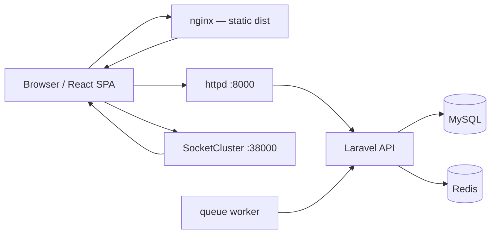

# FleetOps React Console — Deployment Guide

Deploy the **React console** (`frontend/`) against a **Fleetbase API** (`api/`). This repo ships the full stack via Docker; most teams deploy **API + data services** with Docker and **React** as static files behind nginx (or CDN).

| Component | Path | Default port (Docker) |
|-----------|------|---------------------|
| **React console** | `frontend/` | `5173` dev · `80/443` prod |
| **API (nginx → PHP)** | `api/` via `httpd` | **8000** |
| **MySQL** | `database` service | 3306 |
| **Redis** | `cache` service | internal |
| **SocketCluster** (realtime) | `socket` service | **38000** (host) → 8000 (container) |
| **Queue worker** | `queue` service | — |
| **Scheduler (cron)** | `scheduler` service | — |
| **Ember console** (legacy) | `console/` | 4200 |

---

## Architecture



---

## Prerequisites

| Requirement | Notes |
|-------------|--------|
| **Docker + Docker Compose** | Recommended for API stack |
| **Node.js 18+** | Build React (`frontend/`) |
| **Domain or static IP** | Production HTTPS strongly recommended |
| **APP_KEY** | Laravel — generate once, keep secret |
| **CORS / FRONTEND_HOSTS** | Must include your React origin |

Optional for planning features (Phase 2+):

| Service | Env | Purpose |
|---------|-----|---------|
| **OSRM** | `OSRM_HOST` on API | Route geometry |
| **VROOM** | `VROOM_HOST` on API | Route optimization |
| **Google Maps** | `GOOGLE_MAPS_API_KEY` | Maps (if used) |

---

## Deployment paths

| Path | Best for |
|------|----------|
| **[A] Full stack Docker** | Staging / on-prem — API + DB + socket + queue |
| **[B] React only** | API already running — ship `frontend/dist` |
| **[C] LAN / dev server** | Same machine or LAN IP (e.g. `192.168.x.x`) |

---

## A. Full stack Docker (API + services)

### 1. Clone and configure API

```bash
cd d:\fleetbase   # repo root
copy api\.env.example api\.env
```

Edit `api/.env` (minimum):

```env
APP_NAME=Fleetbase
APP_ENV=production
APP_DEBUG=false
APP_KEY=base64:YOUR_KEY_HERE
APP_URL=https://api.yourdomain.com

DB_CONNECTION=mysql
DB_HOST=database
DB_PORT=3306
DB_DATABASE=fleetbase
DB_USERNAME=root
DB_PASSWORD=

BROADCAST_DRIVER=socketcluster
CACHE_DRIVER=redis
QUEUE_CONNECTION=redis
REDIS_HOST=cache

# CORS — REQUIRED for React console
FRONTEND_HOSTS=https://app.yourdomain.com,http://localhost:5173
CONSOLE_HOST=https://app.yourdomain.com

# Routing / VRP (orchestrator)
OSRM_HOST=https://router.project-osrm.org
# VROOM_HOST=http://your-vroom-server:3000
```

Generate `APP_KEY` if empty:

```bash
docker compose run --rm application php artisan key:generate --show
```

Copy the value into `api/.env` → `APP_KEY`.

### 2. Docker override (production)

Copy `docker-compose.override.yml.example` → `docker-compose.override.yml`:

```yaml
version: "3.8"
services:
  application:
    environment:
      APP_ENV: production
      APP_DEBUG: "false"
      CONSOLE_HOST: https://app.yourdomain.com
      FRONTEND_HOSTS: https://app.yourdomain.com
      OSRM_HOST: https://router.project-osrm.org
      MAIL_MAILER: smtp
      # GOOGLE_MAPS_API_KEY: ...
      # VROOM_HOST: http://vroom:3000

  socket:
    environment:
      SOCKETCLUSTER_OPTIONS: '{"origins":"https://app.yourdomain.com:*,wss://app.yourdomain.com:*"}'
```

**Security:** Restrict `SOCKETCLUSTER_OPTIONS` to your real domains in production.

### 3. Start stack

```bash
docker compose up -d
```

Verify:

| URL | Expected |
|-----|----------|
| `http://localhost:8000` | API responds |
| `http://localhost:38000` | SocketCluster (WebSocket) |

First-time DB: place `.sql` / `.sql.gz` in `docker/database/` before first `up`, or run migrations:

```bash
docker compose exec application php artisan migrate --force
```

### 4. Build and deploy React console

See **[B. React frontend only](#b-react-frontend-only)** below — point `VITE_API_HOST` at `http://localhost:8000` or your public API URL.

---

## B. React frontend only

Vite **bakes env vars at build time**. Changing `VITE_*` requires a **rebuild**.

### 1. Environment file

```bash
cd frontend
copy .env.example .env
```

Production `.env` example:

```env
# Public URL of Fleetbase API (no trailing slash)
VITE_API_HOST=https://api.yourdomain.com
VITE_API_NAMESPACE=int/v1
VITE_API_TIMEOUT_MS=20000

# Extension module paths (defaults usually OK)
VITE_STOREFRONT_MODULE_ROOT=storefront/int/v1
VITE_LEDGER_MODULE_ROOT=ledger/int/v1
VITE_PALLET_MODULE_ROOT=pallet/int/v1
VITE_REGISTRY_MODULE_ROOT=registry/v1

# WebSocket — set when API/socket are on another host/port
VITE_SOCKETCLUSTER_HOST=api.yourdomain.com
VITE_SOCKETCLUSTER_PORT=443
VITE_SOCKETCLUSTER_SECURE=true
VITE_SOCKETCLUSTER_PATH=/socketcluster/

# PRODUCTION: do NOT set this (fail-closed permissions)
# VITE_FLEETOPS_PERMISSIVE=true
```

**LAN example** (API on `192.168.0.171:8000`):

```env
VITE_API_HOST=http://192.168.0.171:8000
VITE_SOCKETCLUSTER_HOST=192.168.0.171
VITE_SOCKETCLUSTER_PORT=38000
VITE_SOCKETCLUSTER_SECURE=false
```

And in `api/.env`:

```env
FRONTEND_HOSTS=http://192.168.0.171:5173,http://localhost:5173
```

### 2. Build

```bash
cd frontend
npm ci
npm run build
npm run verify:release
```

Output: `frontend/dist/` (static SPA).

### 3. Serve with nginx

Example `nginx.conf` for SPA + API proxy (single domain):

```nginx
server {
    listen 443 ssl http2;
    server_name app.yourdomain.com;

    root /var/www/fleetops/dist;
    index index.html;

    # React Router — all non-file routes → index.html
    location / {
        try_files $uri $uri/ /index.html;
    }

    # Optional: proxy API on same domain (avoids CORS)
    location /int/ {
        proxy_pass http://127.0.0.1:8000;
        proxy_set_header Host $host;
        proxy_set_header X-Real-IP $remote_addr;
    }

    # WebSocket proxy to SocketCluster
    location /socketcluster/ {
        proxy_pass http://127.0.0.1:38000;
        proxy_http_version 1.1;
        proxy_set_header Upgrade $http_upgrade;
        proxy_set_header Connection "upgrade";
        proxy_set_header Host $host;
    }
}
```

If API is on a **separate domain**, skip the `/int/` block and set `VITE_API_HOST` to the API origin; ensure `FRONTEND_HOSTS` on the API includes the React origin.

### 4. Quick preview (smoke test)

```bash
npm run preview
# Default http://localhost:4173
```

---

## C. Development / LAN access

```bash
# Terminal 1 — API stack
docker compose up

# Terminal 2 — React dev server
cd frontend
npm run dev
# Vite → http://localhost:5173
```

Access from another device on LAN:

1. Set `VITE_API_HOST=http://YOUR_LAN_IP:8000` in `frontend/.env`
2. Add `http://YOUR_LAN_IP:5173` to `FRONTEND_HOSTS` in `api/.env`
3. Restart Vite and ensure firewall allows 5173 + 8000 + 38000

**Permissions in dev:** If `/users/me` returns empty FleetOps permissions, either assign roles in IAM or temporarily set:

```env
VITE_FLEETOPS_PERMISSIVE=true
```

Never use `VITE_FLEETOPS_PERMISSIVE` in production.

---

## Environment reference

### Frontend (`frontend/.env`) — build-time

| Variable | Required | Description |
|----------|----------|-------------|
| `VITE_API_HOST` | **Yes** | API origin, e.g. `https://api.example.com` |
| `VITE_API_NAMESPACE` | Yes | Default `int/v1` |
| `VITE_API_TIMEOUT_MS` | No | Default `20000` |
| `VITE_SOCKETCLUSTER_HOST` | Prod* | Defaults to `window.location.hostname` |
| `VITE_SOCKETCLUSTER_PORT` | Prod* | Default `38000` |
| `VITE_SOCKETCLUSTER_SECURE` | Prod* | `true` behind HTTPS |
| `VITE_SOCKETCLUSTER_PATH` | No | Default `/socketcluster/` |
| `VITE_FLEETOPS_PERMISSIVE` | **Dev only** | Bypass permission gate |
| `VITE_*_MODULE_ROOT` | No | Ledger / Storefront / Pallet / Registry paths |

\* Required when socket is not on same host/port as inferred defaults.

### API (`api/.env`) — runtime

| Variable | Required | Description |
|----------|----------|-------------|
| `APP_KEY` | **Yes** | `php artisan key:generate` |
| `APP_DEBUG` | **false** in prod | |
| `APP_URL` | Yes | Public API URL |
| `FRONTEND_HOSTS` | **Yes** | Comma-separated React origins (CORS) |
| `CONSOLE_HOST` | Yes | Primary console URL (CORS) |
| `DB_*` | Yes | MySQL connection |
| `REDIS_HOST` | Yes with Docker | `cache` service name |
| `QUEUE_CONNECTION` | Yes | `redis` for async jobs |
| `BROADCAST_DRIVER` | Yes | `socketcluster` for realtime |
| `OSRM_HOST` | For routing | Public or self-hosted OSRM |
| `VROOM_HOST` | For VRP | Self-hosted VROOM (503 if down) |
| `GOOGLE_MAPS_API_KEY` | Optional | Maps |

CORS is configured in `api/config/cors.php` using `CONSOLE_HOST` + `FRONTEND_HOSTS`.

---

## Post-deploy checklist

- [ ] `APP_DEBUG=false`, strong `APP_KEY`, secrets not in git
- [ ] `FRONTEND_HOSTS` includes exact React URL (scheme + host + port)
- [ ] `npm run build` + `npm run verify:release` passed
- [ ] Login works; `/users/me` returns user + permissions
- [ ] FleetOps loads (not `fleetops-forbidden`) — roles assigned or permissions on user
- [ ] Orders list loads with server pagination
- [ ] Realtime: order updates without refresh (check browser WebSocket to SocketCluster)
- [ ] Orchestrator / route optimize (if used): `OSRM_HOST` / `VROOM_HOST` reachable from API container
- [ ] Queue worker running: `docker compose ps queue`
- [ ] HTTPS on public URLs; `VITE_SOCKETCLUSTER_SECURE=true` when using WSS
- [ ] `VITE_FLEETOPS_PERMISSIVE` **unset** in production build

### First-account onboarding smoke

- [ ] Fresh DB routes logged-out app to `/install`
- [ ] Installer steps complete in order: `createdb` -> `migrate` -> `seed`
- [ ] Post-install routes to onboarding/auth gate correctly
- [ ] Mock/fresh install path: `should_onboard=true` routes logged-out `/` and `/auth` to `/auth/onboard`
- [ ] Create-account submits once and branches correctly (`skipVerification=true` -> dashboard, otherwise -> verify page)
- [ ] Verify code success authenticates and enters console
- [ ] Resend email + resend SMS show success/error states and retry works
- [ ] Onboarding context clears after successful verify (revisit `/auth/onboard` has no stale data)

### Smoke URLs

| Page | Path |
|------|------|
| Login | `/login` |
| Dashboard | `/` |
| FleetOps orders | `/fleet-ops/operations/orders` |
| Platform health | `/admin/health` |

### FleetOps performance (Phase 8)

| Surface | Limit | Notes |
|---------|-------|--------|
| Orders list | Server pagination (`page`, `limit`) | Do not disable pagination for large tenants; test with 10k+ rows in staging |
| Tracking hub map | **500 markers** max | `FleetTrackingHub` caps client render; see [FLEETOPS-QA-HARDENING.md](./FLEETOPS-QA-HARDENING.md) |

E2E: `npm run test:e2e:fleetops:smoke` · Role matrix: [FLEETOPS-ROLE-QA.md](./FLEETOPS-ROLE-QA.md)

---

## Release verification

```bash
cd frontend
npm run build
npm run verify:release
```

Optional E2E (API must be up):

```bash
npx playwright test tests/e2e/fleetops/form-dropdowns.spec.ts --project=chromium
```

See also [SAAS-RELEASE.md](./SAAS-RELEASE.md) for SaaS/onboarding/demo features.

---

## Troubleshooting

| Symptom | Likely cause | Fix |
|---------|--------------|-----|
| CORS error in browser | React origin not in `FRONTEND_HOSTS` | Add exact origin to `api/.env`, restart `application` |
| `fleetops-forbidden` | Empty permissions on user | Assign FleetOps role in IAM; do not use permissive flag in prod |
| API 502 / connection refused | `httpd` or `application` down | `docker compose ps` · `docker compose logs application` |
| WebSocket fails | Wrong socket host/port or origins | Set `VITE_SOCKETCLUSTER_*`; fix `SOCKETCLUSTER_OPTIONS` |
| Old API URL after deploy | Vite env baked at build | Rebuild with correct `.env` |
| VRP / optimize 503 | VROOM unreachable | Set `VROOM_HOST` or use greedy engine fallback |
| 419 / session errors | Cookie domain mismatch | Align `APP_URL`, HTTPS, same-site cookies |
| Blank page after refresh on `/fleet-ops/...` | nginx missing SPA fallback | Add `try_files ... /index.html` |

### Useful commands

```bash
# API logs
docker compose logs -f application httpd queue

# Regenerate app key
docker compose exec application php artisan key:generate --show

# Cache clear
docker compose exec application php artisan config:clear && php artisan cache:clear

# Queue status
docker compose exec application php artisan queue:status
```

---

## Related docs

| Doc | Purpose |
|-----|---------|
| [README.md](../../README.md) | Official Fleetbase Docker install |
| [SAAS-RELEASE.md](./SAAS-RELEASE.md) | SaaS features, demo mode, health page |
| [FLEETOPS-GAPS.md](./FLEETOPS-GAPS.md) | Feature parity status |
| [FLEETOPS-IMPLEMENTATION-PHASES.md](./FLEETOPS-IMPLEMENTATION-PHASES.md) | Remaining work phases |

Official Fleetbase deployment: [docs.fleetbase.io/deployment](https://docs.fleetbase.io/category/deploying)

---

## Document history

| Version | Change |
|---------|--------|
| 1.0 | Initial React console deployment guide (Docker + static nginx + LAN) |
