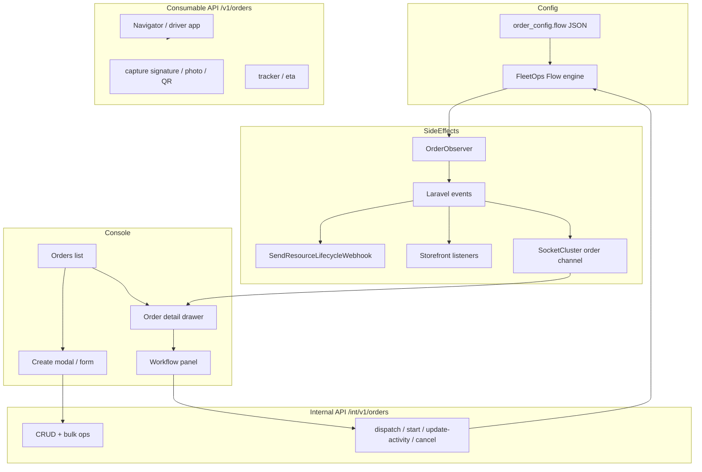
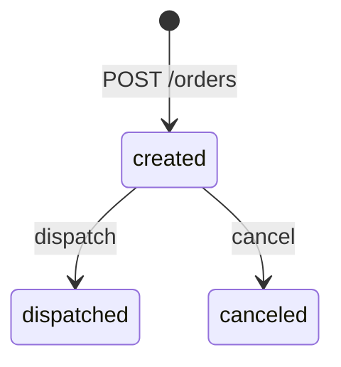
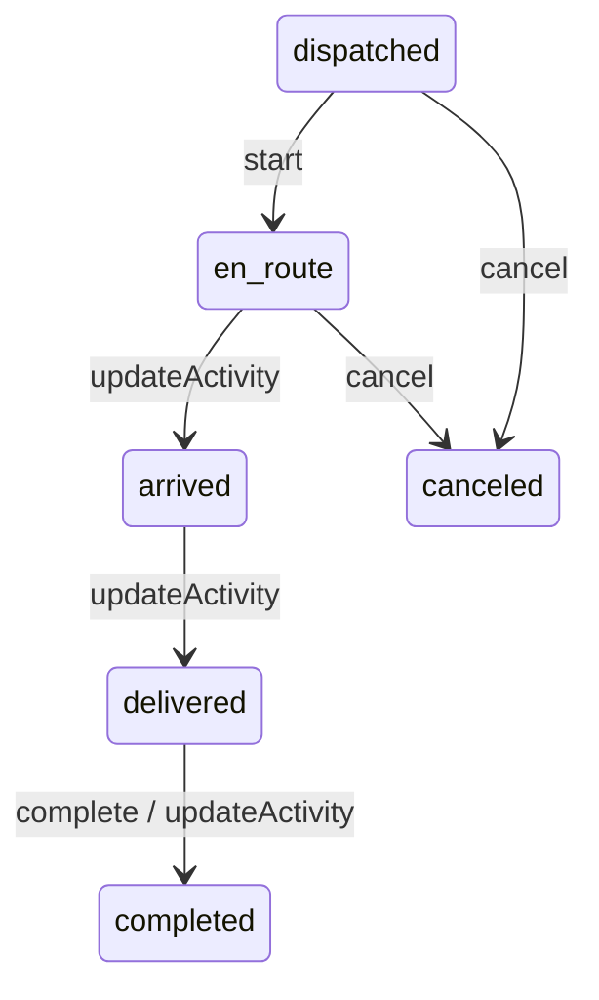
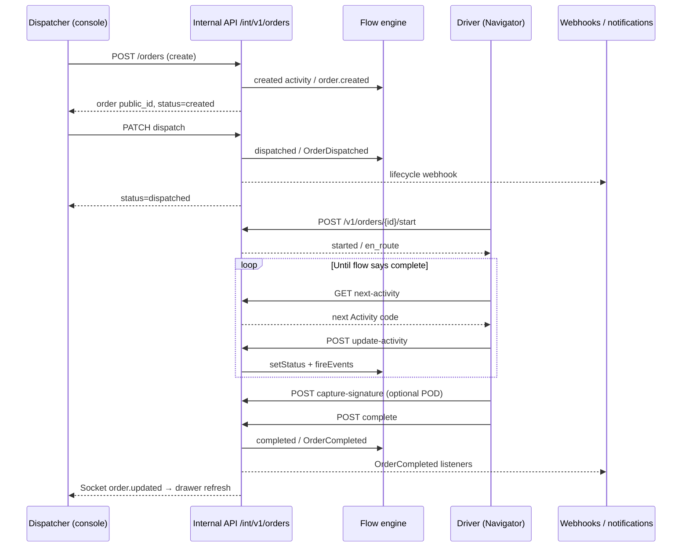

# FleetOps order lifecycle — creation through completion

> **All gaps & parity:** see **[FLEETOPS-GAPS.md](./FLEETOPS-GAPS.md)** (single canonical document).  
> This file covers **order lifecycle, APIs, and events only** — not full platform gaps.

This document synthesizes **`documents/BACKEND-LOW-LEVEL-REQUIREMENTS.md`** (Part IV-B, IV-C, VII) and **`documents/LOW-LEVEL-REQUIREMENTS.md`** (FleetOps orders feature spec, data model, `order-actions`, sockets) into a single end-to-end narrative. It also maps how the **React console** (`frontend/`) implements the same flow today.

---

## 1. Purpose and scope

An **order** is the central FleetOps aggregate. Its life spans:

1. **Configuration** — which activities and statuses apply (`order_configs.flow`)
2. **Creation** — console, import, or Storefront checkout
3. **Planning** — optional schedule, route, payload, rates
4. **Execution** — dispatch → field start → activity steps → proof → complete
5. **Termination** — completed or canceled (with webhooks and notifications)

**In scope:** FleetOps operations orders (`/fleet-ops/operations/orders`), internal `/int/v1/orders`, consumable `/v1/orders` (driver/navigator), related payloads/routes/proofs/tracking.

**Out of scope here:** Pallet WMS sales/purchase orders, maintenance work orders (different domain).

---

## 2. Architecture overview



| Layer | Responsibility |
|--------|----------------|
| **Order config** | Defines activity graph, status codes, events, conditional logic |
| **Order model** | Persists status, assignments, timestamps, relations |
| **Controllers** | HTTP actions: create, dispatch, start, `updateActivity`, complete, cancel |
| **Flow runtime** | `Fleetbase\FleetOps\Flow\*` resolves next activity from config |
| **Observers / events** | Side effects: tracking, notifications, webhooks, Storefront sync |
| **React console** | UX: list → create modal → drawer → workflow actions + realtime |

---

## 3. Order configuration (before any order exists)

Every order is tied to an **`order_config`** (`order_config_uuid`).

| Field | Role |
|--------|------|
| `flow` | JSON activity graph (nodes, child activities, logic, events) |
| `entities` | Payload entity templates |
| `type` / `key` / `namespace` | Order type identity |
| `status` | Config publication state |

### Flow JSON shape (backend)

Stored on `order_configs.flow` and indexed by activity `code`:

```json
{
  "activities": [
    {
      "code": "created",
      "status": "created",
      "activities": ["dispatched"],
      "logic": [{ "type": "and|or|if|not", "conditions": [] }],
      "events": ["order.created"]
    }
  ],
  "created": { "...": "indexed by code for lookup" }
}
```

### Flow engine classes (backend)

| Class | Role |
|--------|------|
| `Flow` | Container; `getActivity(code)`, iterates `activities[]` |
| `Activity` | Node: `code`, child `activities[]`, `logic[]`, `events[]` |
| `Logic` | Gates transitions (`and` / `or` / `if` / `not`) |
| `Flow\Event` | Maps string → Laravel event class → `event()` |

### Standard activity codes (built-in helpers)

| Code | Typical meaning |
|--------|-----------------|
| `created` | Order exists; not yet in field execution |
| `dispatched` | Assigned / released to driver operations |
| `started` | Execution begun (maps to “en route” in UI) |
| `completed` | Terminal success |
| `canceled` | Terminal cancel |

`OrderConfig` helpers: `activities()`, `getCreatedActivity()`, `getDispatchedActivity()`, `getStartedActivity()`, `getCompletedActivity()`, `getCanceledActivity()`, `getActivity(code)`.

**Runtime rule:** Actual edges come from **your** config’s `flow` JSON — not only the default diagram. Use **`GET …/next-activity/{id}`** for the authoritative next step.

---

## 4. Related aggregates (order context)

| Resource | Role in order flow |
|----------|-------------------|
| **payload** | Cargo / line items on the order |
| **entities** | Stops / waypoints linked to payload |
| **routes** | Computed route polyline (OSRM / VROOM) |
| **positions** | GPS history; replay + metrics |
| **proofs** | Signatures, photos, QR captures (POD) |
| **purchase-rates** | Commercial pricing |
| **tracking-numbers** / **tracking-statuses** | Customer-facing tracking |
| **integrated-vendors** | External TMS / marketplace handoff |
| **driver** / **vehicle** | Assignment targets |
| **places** | Pickup / dropoff locations |

---

## 5. End-to-end lifecycle (phases)

### Phase A — Create order

**User journey (console — LLR J-D4):**

| Step | User action | System response |
|------|-------------|-----------------|
| 1 | Clicks **New** on orders list | Opens create flow |
| 2 | Fills Details + Route + Payload (+ rates, notes) | Inline validation |
| 3 | Saves | `POST` order → redirect to detail or list |

**Ember reference URL:** `/fleet-ops/operations/orders/new`  
**React console today:** Centered modal `new-order` on list (`OrderCreateDialog`); deep link `/fleet-ops/operations/orders/new` still supported.

**API:**

| Operation | Method | Endpoint (typical) |
|-----------|--------|-------------------|
| Create | `POST` | `/int/v1/orders` or `/orders` |
| Default config | `GET` | `/int/v1/orders/default-config` |

**Payload sections (LLR §5):**

| Section | Content |
|---------|---------|
| **Details** | Order type / order-config, customer, facilitator, driver/vehicle assignment, POD flag, time windows, scheduled_at |
| **Route** | Waypoints (places), map preview, distance |
| **Payload** | Entities (name, qty, weight, …) |
| **Service rate** | Purchase rate / quote |
| **Notes / documents / metadata** | `notes`, files, `meta` |

**Backend effect:**

- Order persisted with **`status` ≈ `created`** (per config’s created activity)
- `OrderObserver` may run on create
- Flow activity may fire **`order.created`** (and related) events

**Permissions:** `fleet-ops create order`

---

### Phase B — Post-create (created state)

**Order fields (identity & planning):**

| Category | Examples |
|----------|----------|
| Identity | `public_id`, `internal_id`, `type`, `status` |
| Parties | `customer_*`, `facilitator_*`, `driver_*` |
| Locations | `pickup_name`, `dropoff_name` |
| Scheduling | `scheduled_at`, `time_window_start`, `time_window_end`, `eta` |
| Flags | `dispatched: false`, `started: false`, `has_driver_assigned`, `pod_required` |

**Console UX:**

- List: map / table / kanban (`?layout=`); row click → detail drawer `?order={id}`
- Detail drawer: overview, workflow panel, tabs (activity, route, payload, proofs, …)
- **Edit** allowed while status is non-terminal (`canEditOrder` in React)

**Optional — schedule only:**

| API | Purpose |
|-----|---------|
| `POST/PATCH …/schedule` | `scheduleOrder` — schedule without dispatch |

---

### Phase C — Assign driver & dispatch

**Dispatcher journey (LLR J-D2 bulk / single):**

| Step | Action | System |
|------|--------|--------|
| 1 | Select rows or open detail | Selection / header actions |
| 2 | **Dispatch** | Confirm modal (`order.prompts.dispatch-title`) |
| 3 | Confirm | API dispatch → toast → refresh |

**API (internal console):**

| Action | Method | Path suffix |
|--------|--------|-------------|
| Dispatch one | `PATCH` / `POST` | `…/dispatch` or `…/{id}/dispatch` |
| Bulk dispatch | `POST` | `bulk-dispatch` |
| Bulk assign driver | `PATCH` | `bulk-assign-driver` |

**Consumable API (field):** `POST/PATCH {id}/dispatch` → `dispatchOrder`

**Model / flow effect:**

- `dispatch()` sets **dispatched**; may fire **`OrderDispatched`**
- Status moves along config edge: `created` → `dispatched` (typical default graph)

**React transition catalog** (`ORDER_TRANSITIONS.dispatch`):

- Allowed **from:** `created`
- **To:** `dispatched`
- Service: `fleetopsService.dispatchOrder(id)`

**Listeners (async):** `HandleOrderDispatched`, `SendResourceLifecycleWebhook`, `NotifyOrderEvent`, Storefront `HandleOrderDispatched`

**Permissions:** `fleet-ops dispatch order`



---

### Phase D — Start (en route)

**API:**

| API | Action |
|-----|--------|
| Internal | `PATCH …/start` |
| Consumable | `POST {id}/start` → `startOrder` |

**Effect:**

- Order **started** / status commonly shown as **`en_route`** in UI
- May fire **`OrderStarted`** → `HandleOrderStarted` (sync in FleetOps; Storefront listens)

**React:** `ORDER_TRANSITIONS.start` — from `dispatched` → `en_route`

**Navigator:** Driver app uses consumable endpoints + `{id}/track` for GPS ingest.

---

### Phase E — Activity-driven workflow (config-specific)

This is the **richest** part of FleetOps: beyond coarse statuses, orders advance through **activities** defined in `order_config.flow` (e.g. arrive pickup, load, arrive dropoff, unload).

**API:**

| Operation | Method | Purpose |
|-----------|--------|---------|
| Next step | `GET {id}/next-activity` | Returns next `Activity` from flow graph |
| Advance | `POST/PATCH {id}/update-activity` | `updateActivity` — client supplies activity code |

**Backend pipeline (`updateActivity`):**

1. `insertActivity` on order
2. `setStatus(code)` from activity
3. `activity.fireEvents(order)` → Laravel events (`FleetOps\Events\*` or `Fleetbase\Events\*`)

**React:**

- `useOrderDetail` loads `getNextActivity(orderId)` on each refetch
- **Advance activity** transition calls `updateOrderActivity(id, nextActivityCode)`
- Workflow panel shows actions from `getAvailableTransitions(status, { hasNextActivity })`

**UI statuses used in console** (normalized in `domain/fleetops/status.js`):

`created`, `dispatched`, `en_route`, `arrived`, `delivered`, `completed`, `canceled`, `failed`, `delayed`

> Backend flow nodes may use codes like `started` / `completed` while the API/UI expose normalized status strings. Always treat **`next-activity`** and API responses as source of truth for the current step.



---

### Phase F — Proof of delivery (POD)

When `pod_required` or config demands proof, field apps capture evidence **before or during** completion.

**Consumable endpoints:**

| Method | Path | Action |
|--------|------|--------|
| `POST` | `{id}/capture-signature/{subjectId?}` | Signature |
| `POST` | `{id}/capture-photo/{subjectId?}` | Photo |
| `POST` | `{id}/capture-qr/{subjectId?}` | QR scan |
| `GET` | `{id}/proofs/{subjectId?}` | List proofs |

**Console:** Order detail **Proof** tab — gallery / lightbox (LLR `Order::Details::Proof`).

---

### Phase G — Complete order

**API:**

| API | Action |
|-----|--------|
| Consumable | `POST {id}/complete` → `completeOrder` |
| Internal | Activity transition may also reach completed node |

**Effect:**

- `complete()` → **`OrderCompleted`** + completed tracking status
- Listeners: `SendResourceLifecycleWebhook`, `NotifyOrderEvent`, **`HandleDeliveryCompletion`**
- Storefront: `HandleOrderCompleted` (customer notification path)

**React:** `ORDER_TRANSITIONS.complete` — from `en_route`, `arrived`, `delivered` → `completed`

**Terminal state:** Edit / dispatch / cancel actions disabled in UI (`isTerminalOrderStatus`).

---

### Phase H — Cancel (terminal alternative)

**Journey (LLR J-D3):**

| Step | Action | Result |
|------|--------|--------|
| 1 | Open detail | Header actions per permission |
| 2 | **Cancel** | Confirm `order.prompts.cancel-title` |
| 3 | Confirm | Status → **canceled**; edit/update/unassign/cancel disabled |

**API:**

| API | Method |
|-----|--------|
| Consumable | `DELETE {id}/cancel` |
| Internal | `PATCH cancel` (body ids) / bulk-cancel |

**Effect:** Canceled activity + **`OrderCanceled`** → webhooks, notifications, Storefront handlers

**React:** `cancel` from `created`, `dispatched`, `en_route`, `arrived`, `delayed`

---

## 6. Full sequence diagram (happy path)



---

## 7. API surface summary

### Internal console (`/int/v1/orders`, `fleetbase.protected`)

| Method | Path / suffix | Purpose |
|--------|---------------|---------|
| `GET` | default-config | Active order config |
| `GET` | search, statuses, types | Lookups |
| `POST` | `/` | Create |
| `PATCH` | `/{id}` | Update |
| `PATCH` | route/{id} | Edit route geometry |
| `PATCH` | update-activity/{id} | Activity transition |
| `PATCH` | dispatch, start, schedule, cancel | State transitions |
| `POST` | bulk-dispatch, bulk-cancel, bulk-assign-driver | Bulk ops |
| `POST` | process-imports, export | Import / export |

### Consumable field (`/v1/orders`, `fleetbase.api`)

| Method | Path | Purpose |
|--------|------|---------|
| `POST` | `/` | Create |
| `GET` | `{id}` | Detail |
| `POST/PATCH` | `{id}/dispatch` | Dispatch |
| `POST` | `{id}/start` | Start |
| `POST/PATCH` | `{id}/update-activity` | Advance workflow |
| `POST` | `{id}/complete` | Complete |
| `DELETE` | `{id}/cancel` | Cancel |
| `GET` | `{id}/next-activity` | Next activity |
| `GET` | `{id}/tracker`, `{id}/eta` | Tracking |
| `POST` | `{id}/capture-*` | POD |

*React `fleetopsService` tries multiple path variants (`/orders`, `/fleet-ops/orders`, …) for deployment compatibility.*

---

## 8. Events, observers, and realtime

### Eloquent observer

| Model | Observer |
|--------|----------|
| `Order` | `OrderObserver` (FleetOps) |

Runs on create/update/delete — often dispatches domain events or maintains derived data (tracking, indexes).

### Key Laravel events

| Event | Notable listeners |
|--------|-------------------|
| `OrderDispatched` | HandleOrderDispatched, SendResourceLifecycleWebhook, NotifyOrderEvent, Storefront |
| `OrderDriverAssigned` | HandleOrderDriverAssigned, webhooks, NotifyOrderEvent |
| `OrderStarted` | HandleOrderStarted |
| `OrderCompleted` | HandleDeliveryCompletion, webhooks, NotifyOrderEvent, Storefront |
| `OrderCanceled` | HandleOrderCanceled, webhooks, NotifyOrderEvent |
| `OrderFailed` | NotifyOrderEvent, webhooks |

### Socket / realtime (LLR §8 + React Phase 3)

| Item | Specification |
|------|---------------|
| Channel | `order.{public_id}` |
| Subscribe | Order detail enter (`useOrderRealtime`) |
| Events | `order.created`, `order.completed`, `order.updated`, `waypoint.activity`, `entity.activity` |
| UI | Debounced refetch; activity timeline merge; header `syncState`: synced / live / polling |

See [FLEETOPS-PHASE3-REALTIME.md](./FLEETOPS-PHASE3-REALTIME.md).

---

## 9. Storefront integration (order origin path)

Storefront (`/storefront/v1`) can create FleetOps orders via checkout:

1. Browse → cart → checkout → payment  
2. Order linked through **observers/listeners** on dispatch/completion  

Storefront `EventServiceProvider` listens to FleetOps: `OrderStarted`, `OrderDispatched`, `OrderCompleted`, `OrderDriverAssigned`.

---

## 10. Console modals & actions (LLR §7)

| Modal / action | Trigger | On confirm |
|----------------|---------|------------|
| Dispatch | dispatch / bulkDispatch | API dispatch, toast, close |
| Cancel | cancel / bulkCancel | API cancel, disable actions |
| Update activity | updateActivity | Save activity, advance flow |
| Edit details | editOrderDetails | PATCH order (non-canceled) |
| View / edit metadata | viewMetadata / editMetadata | Read / PATCH meta |
| Import | importOrders / order-import | Import job or form fill |

**Global contract:** `startLoading()` → API → `done()` | `stopLoading()` + error banner.

---

## 11. React frontend mapping

| Concern | Location |
|---------|----------|
| Orders list | `src/pages/fleetops/OrdersList.jsx` |
| Create modal | `src/components/fleetops/orders/OrderCreateDialog.jsx` |
| Detail drawer | `src/pages/fleetops/OrderDetail.jsx` + `FleetOpsDetailHost` (`?order=`) |
| Workflow actions | `OrderWorkflowPanel` + `useOrderDetail` → `runOrderTransition` |
| Transition rules | `src/domain/fleetops/transitions/orderTransitions.js` |
| Guards | `src/domain/fleetops/guards/orderGuards.js` |
| API client | `src/services/fleetops.js` |
| Workflow execution | `src/domain/fleetops/workflows/orderWorkflow.js` |
| Realtime | `src/hooks/fleetops/useOrderRealtime.js` |
| E2E | `e2e/fleetops/form-modals.spec.ts`, `order-workflow.spec.ts`, `detail-drawer-edit-modal.spec.ts` |

### Status → UI actions (simplified)

| Status | Typical available actions (if permitted & `nextActivity` present) |
|--------|------------------------------------------------------------------|
| `created` | Edit, Dispatch, Cancel |
| `dispatched` | Start, Advance activity, Cancel, Assign driver |
| `en_route` | Advance activity, Complete, Cancel |
| `arrived` / `delivered` | Advance activity, Complete |
| `completed` / `canceled` | Read-only; no edit |

---

## 12. Permissions (representative)

| Permission | Capability |
|------------|------------|
| `fleet-ops view order` | List + detail |
| `fleet-ops create order` | Create / import |
| `fleet-ops update order` | Edit, update activity |
| `fleet-ops dispatch order` | Dispatch, bulk dispatch |
| `fleet-ops cancel order` | Cancel, bulk cancel |
| `fleet-ops delete order` | Delete |
| Assign driver | `assign` / bulk assign |

Internal routes use `AuthorizationGuard` + Spatie permissions (`fleet-ops {action} {resource}`).

---

## 13. Orchestration & routing (supporting systems)

| System | Role |
|--------|------|
| **OSRM** | Route geometry (`fleetops.osrm.host`) |
| **VROOM** | Route optimization (optional) |
| **ORCHESTRATOR_ENGINE** | `greedy` or external assignment |
| **Geofences** | Enter/exit/dwell events on orders |
| **Telematics webhooks** | GPS ingest without session auth |

List **Optimize routes** (`optimizeOrderRoutes`) and routing page tie into active orders.

---

## 14. Traceability matrix

| Phase | Backend LLRD | Frontend LLRD | React implementation |
|-------|--------------|---------------|----------------------|
| Create | Part IV-B POST `/` | REQ-FO-ORD-CREATE-001, §5 | `OrderCreateDialog`, `createOrder` |
| Config flow | Part IV-C | order-config screen | `order_configs` lookups in forms |
| Dispatch | dispatchOrder | J-D2, §7 dispatch modal | `dispatchOrder`, workflow panel |
| Start | startOrder | — | `startOrder` |
| Activities | updateActivity, next-activity | §4.6 Activity panel | `getNextActivity`, `updateOrderActivity` |
| Complete | completeOrder | — | `completeOrder` |
| Cancel | cancelOrder | J-D3 | `cancelOrder` |
| POD | capture-* / proofs | Proof tab | `OrderDocumentsPanel` / proof tab |
| Realtime | Part VII events | §8 sockets | `useOrderRealtime` |
| Webhooks | SendResourceLifecycleWebhook | — | N/A (server-side) |

---

## 15. References

| Document | Sections used |
|----------|----------------|
| `documents/BACKEND-LOW-LEVEL-REQUIREMENTS.md` | Part IV-B (order lifecycle), IV-C (Flow), VII (events), order event Mermaid |
| `documents/LOW-LEVEL-REQUIREMENTS.md` | Feature spec FleetOps orders (§2–10), `order` model, `order-actions`, `order-socket-events`, order detail tabs |
| `frontend/docs/FLEETOPS-DETAIL-DRAWERS.md` | Drawer URL `?order=` |
| `frontend/docs/FLEETOPS-PHASE3-REALTIME.md` | Socket channels |
| `frontend/docs/FLEETOPS-CRUD-E2E.md` | CRUD E2E coverage |

---

*Generated for the React console migration. Regenerate or extend when `order_config` flows or API routes change.*
