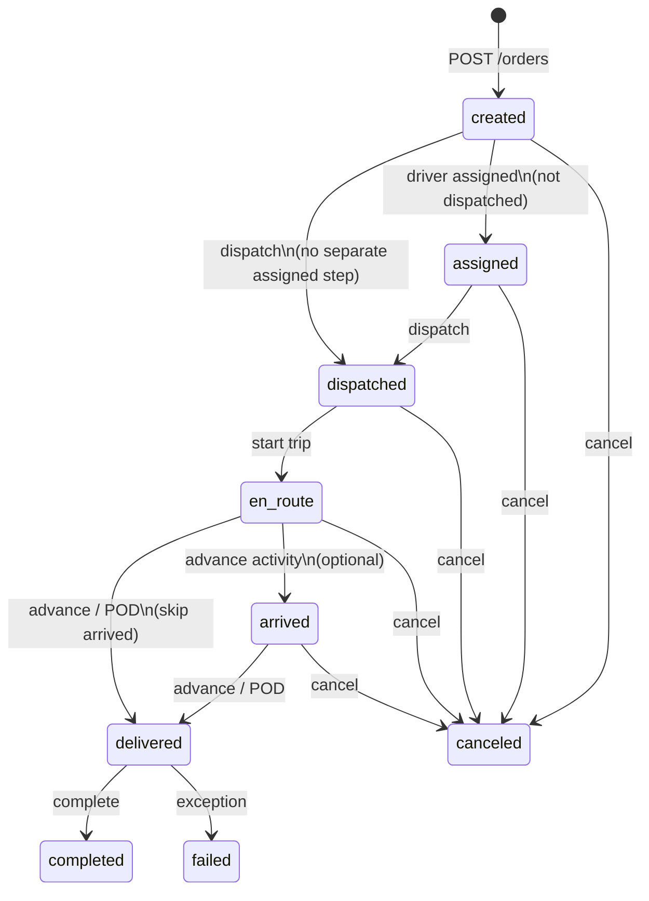

# Order status flow — canonical reference

> **Keep this document updated** whenever order statuses, transitions, or workflow config change.  
> Code source of truth: [`status.js`](./status.js) (web) · [`orderStatus.ts`](../../../../frontend_mobile/frontend/src/lib/orderStatus.ts) (mobile) · [`FleetOps.php`](../../../../packages/fleetops/server/src/Support/FleetOps.php) (default backend config)

---

## Canonical lifecycle

All clients (web console, mobile driver app, APIs) normalize to this flow:

```
created → assigned → dispatched → en_route → arrived → delivered → completed
                                              ↘ canceled / failed
```

| Status | Meaning | Who cares |
|--------|---------|-----------|
| **created** | Order exists; not yet in field execution | Dispatcher, ops |
| **assigned** | Driver (or resource) allocated; not released to field | Dispatcher |
| **dispatched** | Released to driver / field operations | Dispatcher, driver |
| **en_route** | Trip started; driver moving (pickup or dropoff leg) | Driver, customer tracking |
| **arrived** | At a stop (pickup or dropoff) — optional, multi-stop | Driver |
| **delivered** | Goods handed off; POD may be captured | Driver, customer |
| **completed** | Closed in system (billing, reporting) | Ops, finance |
| **canceled** | Intentionally stopped | Ops |
| **failed** | Could not complete (exception) | Ops |

**Terminal statuses** (no further driver/dispatch workflow): `completed`, `canceled`, `failed`.

`delivered` is **not** terminal — ops or the driver may still advance to `completed`.

---

## Diagram



---

## Three layers (how Fleetbase stores state)

| Layer | Where | Purpose |
|-------|--------|---------|
| **1. `orders.status`** | DB column | Persisted activity code from workflow (`Str::snake` on write) |
| **2. Flags** | `dispatched`, `started` (+ timestamps) | Reliable when `status` lags behind real state |
| **3. Order config flow** | `order_configs.flow` JSON | Configurable activity graph per company / order type |

**Rule:** UI and filters use **effective status** (layer 1 + 2 + assignment rules), not raw API strings alone.

---

## Effective status resolution

Implemented in `resolveEffectiveOrderStatus()` (web + mobile):

| Condition | Display status |
|-----------|----------------|
| `started` flag + non-terminal early status | **en_route** |
| `dispatched` flag + status `created` or `assigned` | **dispatched** |
| Driver assigned + not dispatched + status `created` | **assigned** |
| Otherwise | canonical form of `orders.status` |

### Legacy API codes → canonical

| API / workflow code | Canonical display |
|---------------------|-------------------|
| `started` | `en_route` |
| `enroute` | `en_route` |
| `in_transit` | `en_route` |
| `cancelled` | `canceled` |

---

## Allowed transitions (console & apps)

Defined in [`transitions/orderTransitions.js`](./transitions/orderTransitions.js):

| Action | From | To | API |
|--------|------|-----|-----|
| **Dispatch** | `created`, `assigned` | `dispatched` | `PATCH …/dispatch` |
| **Start route** | `dispatched` | `en_route` | `PATCH …/start` |
| **Advance activity** | `dispatched`, `en_route`, `arrived` | next flow step | `PATCH …/update-activity` |
| **Complete** | `en_route`, `arrived`, `delivered` | `completed` | `POST …/complete` |
| **Cancel** | `created` … `delayed` (non-terminal) | `canceled` | `DELETE/PATCH …/cancel` |

`GET …/next-activity/{id}` is authoritative for the **next** step when flow is customized per company.

---

## Default backend transport config

New companies get this flow from [`FleetOps::createTransportConfig()`](../../../../packages/fleetops/server/src/Support/FleetOps.php):

```
created → dispatched → en_route → delivered → completed
```

- **Start trip** sets `started = true` and applies the `en_route` activity (legacy configs may still use `started` / `enroute` codes).
- **Backward compatibility:** `OrderConfig::getStartedActivity()` and `resolveWorkflowStatusCode()` try `en_route`, then `started`, then `enroute`.

### One-time migration (existing companies)

Upgrade legacy transport configs (`started` / `enroute` chains) in the database:

```bash
# Preview changes
php artisan fleetops:upgrade-transport-order-config-flows --dry-run

# Apply to all companies with legacy transport configs
php artisan fleetops:upgrade-transport-order-config-flows

# Single company
php artisan fleetops:upgrade-transport-order-config-flows --company={company_uuid}

# Overwrite customized transport configs (use with care)
php artisan fleetops:upgrade-transport-order-config-flows --force
```

| Option | Effect |
|--------|--------|
| `--dry-run` | List what would change; no writes |
| `--company=` | Limit to one company UUID |
| `--force` | Upgrade even non-legacy / customized flows |

**Safe default:** only configs that still use the legacy `created → dispatched → started → enroute → completed` pattern (or are missing `en_route` / `delivered`) are updated. Already-canonical `0.0.2` configs are skipped.

Implementation: `packages/fleetops/server/src/Console/Commands/UpgradeTransportOrderConfigFlows.php`

---

## Web console

| Concern | File |
|---------|------|
| Status list, normalization, effective status | [`status.js`](./status.js) |
| Transition catalog | [`transitions/orderTransitions.js`](./transitions/orderTransitions.js) |
| Can dispatch / start / complete guards | [`guards/orderGuards.js`](./guards/orderGuards.js) |
| Labels in UI | `statusLabel()` in `src/lib/mappers.js` → `orderStatusLabel()` |
| Order list filters | `src/pages/fleetops/OrdersList.jsx` |
| Workflow panel | `src/pages/fleetops/OrderDetail.jsx` |
| Default flow preview | `src/lib/fleetops/orderConfig.js` → `DEFAULT_ORDER_FLOW` |

### List filter chips

`created` · `assigned` · `dispatched` · `en_route` · `arrived` · `delivered` · `completed` · `canceled`

---

## Mobile driver app

| Concern | File |
|---------|------|
| Status helpers (mirrors web) | [`orderStatus.ts`](../../../../frontend_mobile/frontend/src/lib/orderStatus.ts) |
| API → UI mapping | `src/lib/orderMapper.ts` |
| Status badge labels | `src/components/StatusBadge.tsx` |
| Orders tabs | `app/(tabs)/orders.tsx` |

### Driver tab buckets

| Tab | Statuses | Intent |
|-----|----------|--------|
| **Assigned** | `created`, `assigned`, `scheduled`, `dispatched` | In your queue; trip not started |
| **Active** | `en_route`, `arrived`, `delivered` | On the road |
| **Completed** | `completed`, `canceled`, `failed` | Closed |

### Driver actions

| Button | Requires status |
|--------|-----------------|
| **Start trip** | `dispatched` |
| **Complete** | `en_route`, `arrived`, or `delivered` |
| **Navigate to pickup** | Before trip in progress |
| **Navigate to dropoff** | `en_route` / `arrived` / `delivered` (`isTripInProgress()`) |

---

## Backend API quick reference

| Method | Path (consumable `/v1/orders`) | Effect |
|--------|--------------------------------|--------|
| `POST` | `/` | Create → `created` |
| `PATCH` | `{id}/dispatch` | → `dispatched`, `dispatched=true` |
| `POST` | `{id}/start` | → `en_route` (typical), `started=true` |
| `PATCH` | `{id}/update-activity` | Advance per `order_config.flow` |
| `POST` | `{id}/complete` | → `completed` |
| `DELETE` | `{id}/cancel` | → `canceled` |
| `GET` | `{id}/next-activity` | Next activity from flow |

Internal console uses `/int/v1/orders` with the same semantics.

---

## Custom order configs

Companies may add/remove activities in **Order Config Manager**. Rules:

1. **Do not** expose raw codes like `started` in UI — normalize to `en_route`.
2. **Do not** add duplicate “moving” steps (`started` then `enroute`) in new configs.
3. Prefer activity code **`en_route`** for the post-start step.
4. Use **`delivered`** before **`completed`** when POD is required.
5. After changing flow JSON, verify with `next-activity` and a test order on web + mobile.

---

## Related documentation

| Document | Scope |
|----------|--------|
| [`frontend/docs/FLEETOPS-ORDER-LIFECYCLE.md`](../../docs/FLEETOPS-ORDER-LIFECYCLE.md) | Full lifecycle, APIs, events, sockets |
| [`packages/fleetops/server/docs/ORDER-STATUS-FLOW.md`](../../../../packages/fleetops/server/docs/ORDER-STATUS-FLOW.md) | Pointer to this file (backend package) |
| [`frontend_mobile/frontend/src/lib/ORDER-STATUS-FLOW.md`](../../../../frontend_mobile/frontend/src/lib/ORDER-STATUS-FLOW.md) | Pointer to this file (mobile) |

---

## Changelog

| Date | Change |
|------|--------|
| 2026-06-05 | Unified flow across backend default config, web `status.js`, and mobile `orderStatus.ts`. Collapsed `started`/`enroute` into `en_route`. Added `assigned` (derived) and `delivered` before `completed`. |
| 2026-06-05 | Added `php artisan fleetops:upgrade-transport-order-config-flows` to migrate existing transport `order_configs` in the database. |
