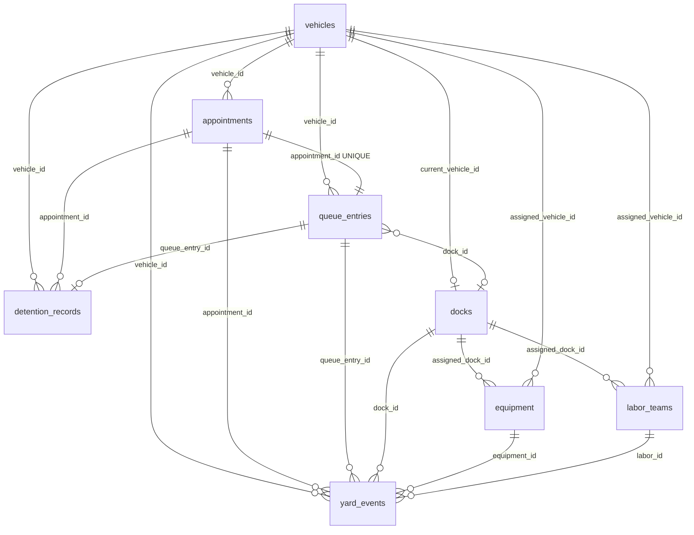

# Data Model / ERD — Smart Yard / YMS

Source of truth: `backend/db.py` (`create_schema`). No separate migration files.

## Entity relationship (logical)

## Tables

### `vehicles` (master)

| Column | Type | Notes |
|--------|------|--------|
| `id` | UUID PK | |
| `vehicle_number` | TEXT UNIQUE | Plate / fleet number |
| `vehicle_type` | TEXT | |
| `ownership_type` | TEXT | `company`, `contract`, `outside` |
| `transporter_name`, `driver_name`, `driver_phone` | TEXT | |
| `status` | TEXT | YMS lifecycle — see `enums.YMS_STATUSES` |
| `created_at`, `updated_at` | TIMESTAMPTZ | |

### `appointments` (master)

| Column | Type | Notes |
|--------|------|--------|
| `id` | UUID PK | |
| `booking_reference` | TEXT UNIQUE | |
| `vehicle_id` | UUID FK → vehicles | RESTRICT |
| `customer_name`, `shipment_reference` | TEXT | Cargo hints in shipment string |
| `booking_date` | DATE | |
| `reporting_time` | TIMESTAMPTZ | Used for priority score |
| `scheduled_slot`, `gate_number` | TEXT | Gate used for **derived** zones |
| `priority` | INT | |
| `status` | TEXT | Same enum family as vehicles |
| `remarks` | TEXT nullable | |

### `queue_entries` (operational)

| Column | Type | Notes |
|--------|------|--------|
| `id` | UUID PK | |
| `appointment_id` | UUID FK UNIQUE | One queue per appointment |
| `vehicle_id` | UUID FK | |
| `queue_number` | TEXT UNIQUE | |
| `queue_type` | TEXT | load/unload hints |
| `priority_score` | INT | Computed at check-in |
| `checkin_time`, `called_time`, `dock_assigned_time` | TIMESTAMPTZ nullable | |
| `dock_id` | UUID FK nullable | |
| `status` | TEXT | |

### `docks` (master + operational state)

| Column | Type | Notes |
|--------|------|--------|
| `id` | UUID PK | |
| `dock_code` | TEXT UNIQUE | |
| `dock_name`, `dock_type` | TEXT | Type drives cold/hazmat heuristics |
| `supported_vehicle_types`, `supported_cargo_types` | TEXT[] | |
| `status` | TEXT | AVAILABLE, OCCUPIED, MAINTENANCE, BLOCKED |
| `current_vehicle_id` | UUID FK nullable | |

### `yard_events` (audit / derived analytics input)

| Column | Type | Notes |
|--------|------|--------|
| `id` | UUID PK | |
| FKs | vehicle, appointment, queue, dock, equipment, labor | All nullable |
| `event_type` | TEXT | e.g. VEHICLE_CHECKED_IN, DOCK_ASSIGNED, LOADING_* |
| `event_time` | TIMESTAMPTZ | |
| `event_note` | TEXT nullable | |
| `created_by` | TEXT | |

### `equipment` (master)

| Column | Type | Notes |
|--------|------|--------|
| `id` | UUID PK | |
| `equipment_code` | TEXT UNIQUE | |
| `equipment_type`, `model` | TEXT | |
| `status` | TEXT | IDLE, ASSIGNED, IN_USE, … |
| `battery_level` | INT nullable | |
| `operator_name`, `current_location` | TEXT nullable | |
| `assigned_dock_id`, `assigned_vehicle_id` | UUID FK nullable | |
| `maintenance_due` | DATE nullable | |
| `notes` | TEXT nullable | |

### `labor_teams` (master)

| Column | Type | Notes |
|--------|------|--------|
| `id` | UUID PK | |
| `team_code` | TEXT UNIQUE | |
| `team_name` | TEXT | |
| `shift_start`, `shift_end` | TEXT | |
| `members_count`, `available_count`, `assigned_count` | INT | |
| `status` | TEXT | ON_DUTY, ASSIGNED, … |
| `supervisor_name`, `current_assignment`, `current_location` | TEXT nullable | |
| `assigned_dock_id`, `assigned_vehicle_id` | UUID FK nullable | |

### `detention_records` (operational + billing)

| Column | Type | Notes |
|--------|------|--------|
| `id` | UUID PK | |
| `detention_ref` | TEXT UNIQUE | |
| `vehicle_id` | UUID FK | |
| `queue_entry_id`, `appointment_id` | UUID FK nullable | |
| `billing_date` | DATE | |
| `plate`, `category`, `transporter` | TEXT | Category from ownership |
| `free_hours`, `actual_hours` | NUMERIC | |
| `rate`, `cost` | INT | |
| `status` | TEXT | Pending, Approved, Disputed, Paid, Reviewed |
| `remarks` | TEXT nullable | |
| `is_estimated` | BOOLEAN | |

**Derived:** rows created/updated by `detention_service.list_detention_records()` from queue + vehicles + events, not only manual POST.

### `status_checks` (legacy)

| Column | Type |
|--------|------|
| `id` | UUID PK |
| `client_name` | TEXT |
| `timestamp` | TIMESTAMPTZ |

Unrelated to YMS operations; used by `/api/status`.

---

## Not stored (derived in frontend)

| Concept | How represented |
|---------|------------------|
| **Yard zones A–F** | `yardMapApi.js` / `controlTowerApi` — from status, queue_type, gate_number, dock_type, shipment keywords |
| **Zone occupancy counts** | Count vehicles assigned to zone codes |
| **Vehicle map coordinates** | Deterministic grid slots by plate within zone |
| **Control Tower KPIs** | Computed in `controlTowerApi.js` |
| **Executive KPI scorecard** | Computed in `executiveKpisApi.js` |
| **Loading progress %** | `docksApi.estimateProgress()` from timestamps |
| **AI insights** | `db.js` mock only |

---

## Unique constraints (summary)

- `vehicles.vehicle_number`
- `appointments.booking_reference`
- `queue_entries.queue_number`, `queue_entries.appointment_id`
- `docks.dock_code`
- `equipment.equipment_code`
- `labor_teams.team_code`
- `detention_records.detention_ref`

---

## Lifecycle / status fields

| Entity | Field | Valid values (backend) |
|--------|-------|------------------------|
| Vehicle / appointment / queue | `status` | `YMS_STATUSES` + transitions in `STATUS_TRANSITIONS` |
| Dock | `status` | `DOCK_STATUSES` |
| Equipment | `status` | `EQUIPMENT_STATUSES` + `EQUIPMENT_STATUS_TRANSITIONS` |
| Labor | `status` | `LABOR_STATUSES` + `LABOR_STATUS_TRANSITIONS` |
| Detention | `status` | `DETENTION_STATUSES` + `DETENTION_STATUS_TRANSITIONS` |

---

## Indexes

Created in `db.py` for: vehicle_number, status fields, booking_reference, queue_number, dock_code, event_time DESC, equipment/labor codes, detention ref/status/billing_date/vehicle.

---

## Master vs operational

| Master | Operational / audit |
|--------|---------------------|
| vehicles, appointments, docks, equipment, labor_teams | queue_entries, yard_events |
| detention_records (hybrid: persisted but often auto-derived) | |
