# System Architecture Document (SAD)
# Smart Yard Management System — YARD.OS

---

| Field | Value |
|-------|-------|
| **Document Title** | System Architecture Document — YARD.OS |
| **Product** | YARD.OS — Vehicle Orchestration Platform |
| **Version** | 1.0 |
| **Status** | Implementation-Aligned |
| **Date** | June 2026 |
| **Audience** | Architects, Developers, DevOps, Security, Integration Teams |
| **Source of Truth** | `yard_frontend/` codebase (React 19 + FastAPI + PostgreSQL 16) |
| **Companion Docs** | `YMS_Functional_Requirements_Specification.md`, `DATA_MODEL_ERD.md`, `API_INVENTORY.md` |

---

## Document Control

| Version | Date | Author | Changes |
|---------|------|--------|---------|
| 1.0 | June 2026 | YMS Engineering | Initial architecture document from implemented platform |

---

## Table of Contents

1. [Architecture Overview](#1-architecture-overview)
2. [Solution Architecture](#2-solution-architecture)
3. [Frontend Architecture](#3-frontend-architecture)
4. [Backend Architecture](#4-backend-architecture)
5. [Database Architecture](#5-database-architecture)
6. [API Architecture](#6-api-architecture)
7. [Event Architecture](#7-event-architecture)
8. [Lifecycle Engine Architecture](#8-lifecycle-engine-architecture)
9. [Control Tower Architecture](#9-control-tower-architecture)
10. [Loading Operations Architecture](#10-loading-operations-architecture)
11. [Reporting Architecture](#11-reporting-architecture)
12. [Cross-Module Synchronization Architecture](#12-cross-module-synchronization-architecture)
13. [Role-Based Access Architecture](#13-role-based-access-architecture)
14. [Docker Deployment Architecture](#14-docker-deployment-architecture)
15. [Data Flow Diagrams](#15-data-flow-diagrams)
16. [Sequence Diagrams](#16-sequence-diagrams)
17. [Integration Architecture](#17-integration-architecture)
18. [Security Architecture](#18-security-architecture)
19. [Scalability Considerations](#19-scalability-considerations)
20. [Future OCR Architecture](#20-future-ocr-architecture)
21. [Future ERP/Fleet Integration Architecture](#21-future-erpfleet-integration-architecture)

---

# 1. Architecture Overview

## 1.1 Purpose

YARD.OS is a **vehicle orchestration platform** for yard operations: appointment scheduling, gate entry/exit, virtual queue management, dock assignment, resource gating (labor/equipment), loading operations, detention tracking, and operational analytics.

The system follows a **classic three-tier web architecture** with a single-page application (SPA), a monolithic REST API, and a relational database. There is no separate message broker, event bus, or microservice mesh in the current implementation — coordination happens through **PostgreSQL transactions**, an **append-only audit log** (`yard_events`), and a **browser-side sync event** (`yms-data-changed`).

## 1.2 Architectural Principles (As Implemented)

| Principle | Implementation |
|-----------|----------------|
| Single source of truth | PostgreSQL for all operational state |
| Audit by default | Every workflow step emits `yard_events` |
| Lifecycle enforcement | `STATUS_TRANSITIONS` graph in `enums.py`; guarded in `yms_service` |
| Thin routers, fat services | FastAPI routers delegate to `services/` modules |
| Client aggregation where cheap | Control Tower, Executive KPIs aggregate list APIs |
| Server aggregation where canonical | Operations Dashboard, Reports use dedicated services |
| Header-based RBAC | `X-YMS-Role` / `X-YMS-User` on every API call |
| Operational polling | 30-second refresh + mutation-triggered sync |

## 1.3 High-Level Context Diagram

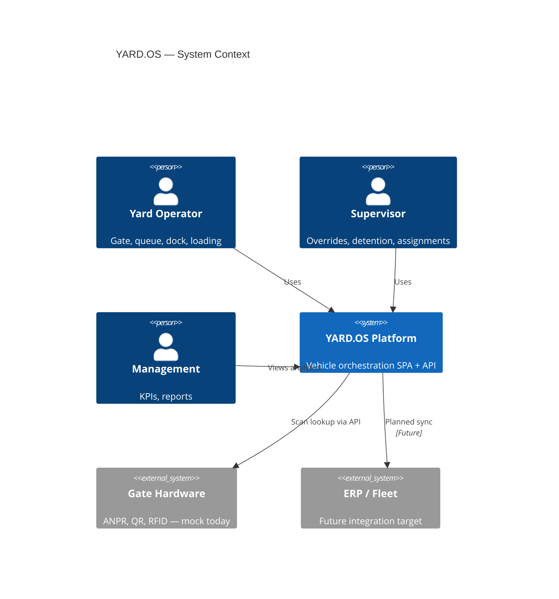

## 1.4 Technology Stack

| Layer | Technology | Version | Notes |
|-------|------------|---------|-------|
| UI | React + React Router | 19 / 7 | CRA build, Tailwind CSS 3.4 |
| UI hosting | nginx | 1.27-alpine | Static SPA, port 3001→80 |
| API | FastAPI + uvicorn | 0.110 | Async Python 3.11 |
| DB driver | asyncpg | 0.29 | Connection pool |
| Database | PostgreSQL | 16-alpine | Port 5433→5432 |
| Charts | Recharts | — | KPIs, reports |
| Container | Docker Compose | 3-service stack | Health checks on all services |

---

# 2. Solution Architecture

## 2.1 Logical Layers

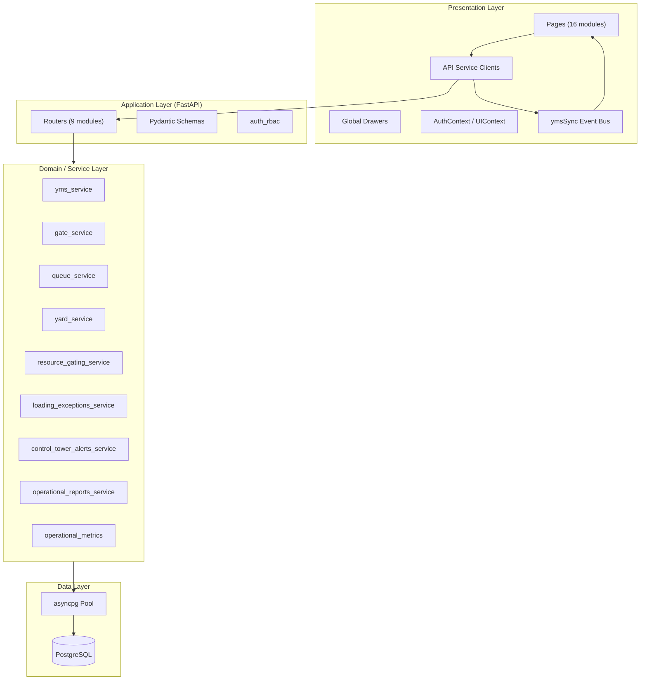

## 2.2 Module Map

| UI Module | Primary Backend Services | Router(s) |
|-----------|-------------------------|-----------|
| Control Tower | Client aggregation + `control_tower_alerts_service` | `control_tower`, `yms` |
| Recommendations | `control_tower_alerts_service` (via client) | `control_tower` |
| Appointments | `yms_service` | `yms` |
| Gate | `gate_service`, `yms_service` | `gate`, `yms` |
| Virtual Queue | `queue_service`, `yms_service` | `queue`, `yms` |
| Vehicles | `yms_service` | `yms` |
| Docks | `yms_service`, `dock_resource_service`, `resource_gating_service` | `yms` |
| Labor | `labor_service`, `resource_gating_service` | `yms` |
| Equipment | `equipment_service`, `resource_gating_service` | `yms` |
| Loading Ops | `loading_exceptions_service`, `yms_service` | `loading_ops`, `yms` |
| Yard Map | `yard_service` | `yard` |
| Operations Dashboard | `operations_dashboard_service`, `operational_metrics` | `reports` |
| Delay Analysis | `operational_reports_service` | `reports` |
| Detention | `detention_service` | `yms` |
| Executive KPIs | Client aggregation | `yms` (list APIs) |
| Reporting (6 reports) | `operational_reports_service`, `vehicle_journey_report_service` | `reports` |

## 2.3 Deployment Topology

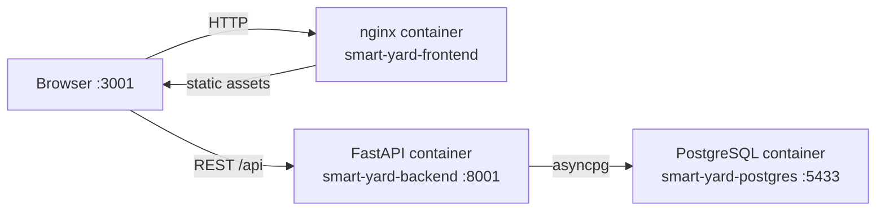

## 2.4 Request Lifecycle

1. Browser loads SPA from nginx (`frontend_1` build).
2. `AuthProvider` reads role from `localStorage`, fetches `/auth/me` and `/auth/permissions`.
3. Page components call service modules (`ymsApi.js`, etc.) with `X-YMS-Role` header.
4. FastAPI router validates RBAC via `require_permission()` dependency.
5. Service layer executes business logic inside asyncpg connection (optionally in transaction).
6. Mutations emit `yard_events` and return updated entities.
7. Frontend calls `notifyYmsDataChanged()` → all subscribed views refresh within 30s poll window.

---

# 3. Frontend Architecture

## 3.1 Application Structure

```
frontend_1/src/
├── App.js                 # Route definitions (16 pages + 6 reports)
├── contexts/
│   ├── AuthContext.jsx    # Role, permissions, can()
│   └── UIContext.jsx      # Drawer state, global search, dialogs
├── hooks/
│   ├── usePermissions.js  # RBAC UI guards
│   ├── useOperationalAutoRefresh.js  # 30s poll + yms-data-changed
│   └── useYmsSyncRefresh.js          # Drawer-level refresh
├── pages/                 # Route-level screens
├── components/yms/        # Shared YMS components, drawers, dialogs
├── services/              # API clients (one per domain)
├── constants/             # lifecycleStatuses, yardConstants
└── utils/                 # resourceGating, dockTypeSelectors, assignmentContext
```

## 3.2 Routing Architecture

`App.js` defines all routes under `AppLayout` (shell with TopNav, global drawers, Toaster):

| Path | Page Component |
|------|----------------|
| `/` | `Dashboard.jsx` (Control Tower) |
| `/appointments` | `Appointments.jsx` |
| `/gate` | `Gate.jsx` |
| `/queue` | `VirtualQueue.jsx` |
| `/yard` | `YardMap.jsx` |
| `/docks` | `Docks.jsx` |
| `/vehicles` | `Vehicles.jsx` |
| `/loading` | `LoadingOps.jsx` |
| `/detention` | `Detention.jsx` |
| `/equipment` | `Equipment.jsx` |
| `/labor` | `Labor.jsx` |
| `/ai` | `AiInsights.jsx` (Recommendations) |
| `/kpis` | `Kpis.jsx` |
| `/operations-dashboard` | `OperationsDashboard.jsx` |
| `/reports/*` | Six report pages |

## 3.3 Component Architecture

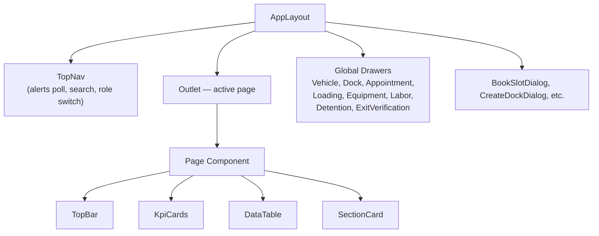

**Drawer pattern:** `UIContext` holds `{ vehicle, dock, appointment, loading, equipment, labor, detention }` selection state. Any page can open a drawer by calling `openVehicle(id)`, etc. Drawers use `useYmsSyncRefresh` to reload when mutations occur elsewhere.

## 3.4 State Management

| State Type | Mechanism | Scope |
|------------|-----------|-------|
| Auth / RBAC | `AuthContext` + `localStorage` | Global |
| Drawer / dialog | `UIContext` | Global |
| Page data | `useState` + `useCallback` load functions | Per page |
| Server cache | None (no React Query) — refetch on poll/event | — |
| Cross-page sync | `ymsSync.js` CustomEvent | Global |

## 3.5 API Client Layer

All HTTP calls flow through domain service modules:

| Service File | Responsibility |
|--------------|----------------|
| `ymsApi.js` | Core CRUD, flow transitions, shared `request()` |
| `gateManagementApi.js` | Gate lookup, entry, exit |
| `queueApi.js` | Queue bundle, override |
| `docksApi.js` | Dock operations, readiness |
| `loadingOpsApi.js` | Exceptions, pause/resume |
| `controlTowerApi.js` | KPI computation (client-side) |
| `controlTowerAlertsApi.js` | Alerts fetch |
| `executiveKpisApi.js` | Executive scorecard aggregation |
| `operationsDashboardApi.js` | Server dashboard bundle |
| `reportsApi.js` | Report endpoints + export |
| `aiInsightsApi.js` | Alert → recommendation mapping |
| `authApi.js` / `authStorage.js` | Role headers, localStorage |

**Base URL:** `REACT_APP_API_BASE_URL` (default `http://localhost:8001/api`), baked at Docker build time.

## 3.6 Client-Side Engines

| Engine | File | Purpose |
|--------|------|---------|
| Loading Progress | `loadingProgressEngine.js` | ETA, health (ON_TIME/AT_RISK/DELAYED) from yard_events |
| Loading Pause | `loadingPauseEngine.js` | Pause state from LOADING_PAUSED/RESUMED events |
| Resource Gating UI | `utils/resourceGating.js` | Format 409 RESOURCE_GATING_FAILED messages |
| Gate Scanner | `gateScanner.js` | Pluggable QR/ANPR/gate-pass providers (mock default) |

## 3.7 Refresh Strategy

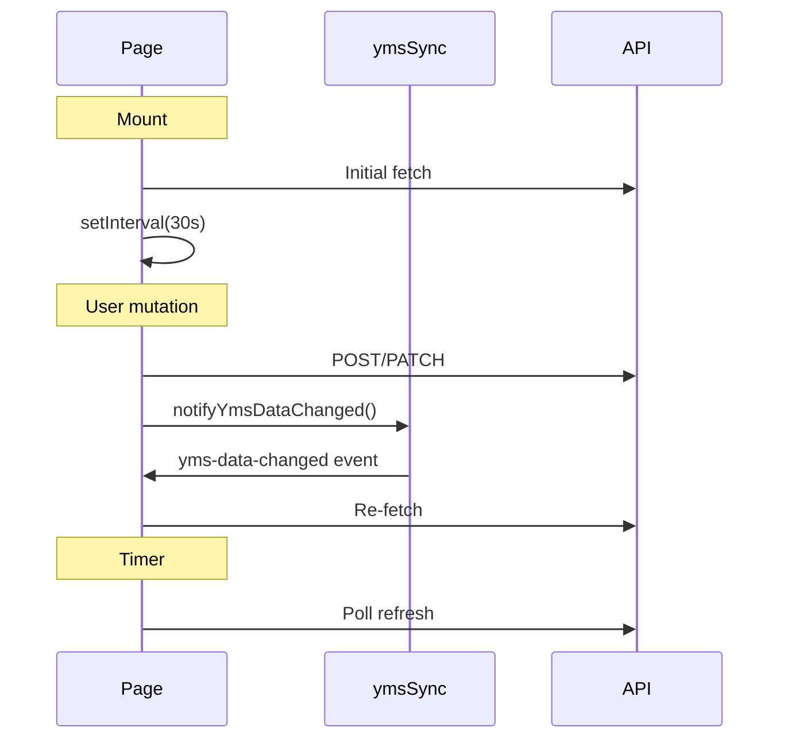

---

# 4. Backend Architecture

## 4.1 Application Entry

`server.py` bootstraps:
- `FastAPI()` application
- `APIRouter(prefix="/api")` mounting all routers
- CORS middleware (`CORS_ORIGINS` env, default `*`)
- Startup: `init_db()` → asyncpg pool + `create_schema()`
- Shutdown: `close_db()`

## 4.2 Router Layer

| Router | Prefix | Endpoints (summary) |
|--------|--------|---------------------|
| `yms.py` | `/api` | vehicles, appointments, queue-entries, docks, yard-events, flow, detention, equipment, labor, readiness |
| `gate.py` | `/api/gate` | lookup, arrived, approve-entry, exit-holding, verify-exit, gate-out, scan |
| `queue.py` | `/api/queue` | bundle, entries/{id}/detail, entries/{id}/override |
| `yard.py` | `/api/yard` | zones CRUD, move-vehicle |
| `loading_ops.py` | `/api/loading-operations` | exceptions CRUD, pause, resume, pause-state |
| `control_tower.py` | `/api/control-tower` | alerts |
| `reports.py` | `/api/reports` | 7 report endpoints + 5 export endpoints |
| `search.py` | `/api/search` | global search |
| `auth.py` | `/api/auth` | me, roles, permissions |
| `status.py` | `/api` | health root |

## 4.3 Service Layer

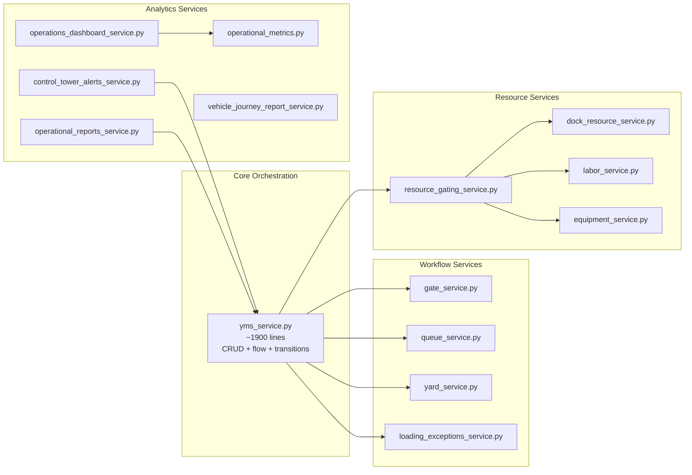

## 4.4 Key Service Responsibilities

| Service | Responsibility |
|---------|----------------|
| `yms_service.py` | Master CRUD for vehicles, appointments, queue, docks, events; `check_in_vehicle`, `call_queue_entry`, `assign_dock`, `transition_vehicle_status`, `_release_vehicle_dock_assignments` |
| `gate_service.py` | Entry 6-check validation, exit 7-check checklist, gate-out |
| `queue_service.py` | Queue bundle enrichment, priority override, detail with readiness |
| `resource_gating_service.py` | `validate_resource_readiness_for_loading`, `sync_vehicle_readiness_status` |
| `yard_service.py` | Zone CRUD, `sync_vehicle_zone_for_status`, capacity rules |
| `loading_exceptions_service.py` | Exception lifecycle, pause/resume, `compute_pause_state` |
| `control_tower_alerts_service.py` | Derived alert computation (9 types) |
| `operational_metrics.py` | Canonical KPI counting functions |
| `detention_service.py` | Detention accrual, status workflow |

## 4.5 Transaction Boundaries

Critical multi-step operations use **explicit transactions**:

| Operation | Transaction Scope |
|-----------|-------------------|
| `transition_vehicle_status` | Full transition + events + resource release + EXIT_HOLDING cascade |
| `assign_dock` | Dock OCCUPIED + queue update + vehicle status + events |
| `check_in_vehicle` | Vehicle WAITING + queue create + appointment sync + zone move |
| `approve_entry` | Gate verification + check-in chain |

Pattern in `yms_service.py`:
```python
async with pool.acquire() as acquired:
    async with acquired.transaction():
        return await _run(acquired)
```

## 4.6 Schema Validation

`schemas.py` defines Pydantic models for all request/response bodies. Routers use `response_model=` for OpenAPI documentation. Validation errors return HTTP 422.

## 4.7 Configuration

| Variable | Location | Purpose |
|----------|----------|---------|
| `DATABASE_URL` | `.env` / Docker | PostgreSQL connection string |
| `CORS_ORIGINS` | Docker env | Allowed browser origins |
| `REACT_APP_API_BASE_URL` | Docker build arg | Frontend API base |

---

# 5. Database Architecture

## 5.1 Schema Management

Schema is defined in `backend/db.py` → `create_schema()`. There are **no Flyway/Alembic migrations** — tables are created with `CREATE TABLE IF NOT EXISTS` on startup. Schema evolution is handled via inline `ALTER TABLE` guards in `create_schema()`.

## 5.2 Entity Relationship

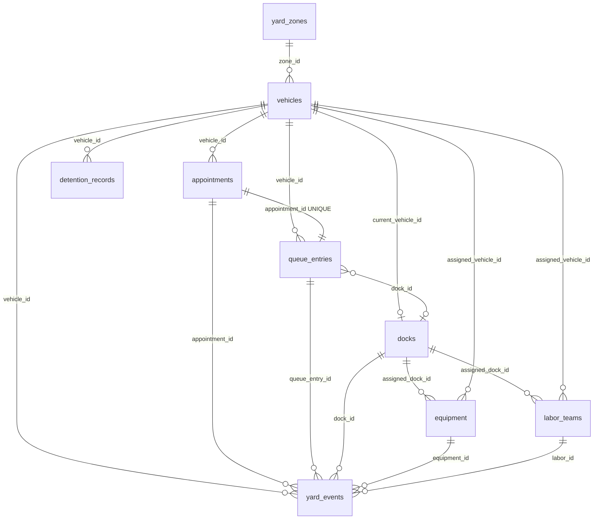

## 5.3 Table Inventory

| Table | Type | Purpose |
|-------|------|---------|
| `vehicles` | Master | Vehicle identity, lifecycle status, zone_id, exit_holding_at |
| `appointments` | Master | Booking, slot, gate, priority |
| `queue_entries` | Operational | Virtual queue state, priority_score, dock link |
| `docks` | Master + state | Bay config, OCCUPIED/AVAILABLE, current_vehicle_id |
| `yard_zones` | Master | Spatial zones, capacity, occupancy |
| `yard_events` | Audit | Append-only event log (62 event types) |
| `equipment` | Master | Forklifts, cranes, battery, assignments |
| `labor_teams` | Master | Teams, shifts, assignments |
| `detention_records` | Operational | Detention charges, approval workflow |
| `loading_operation_exceptions` | Operational | Loading exceptions, pause context |
| `gate_verifications` | Operational | Entry/exit checklist persistence |
| `status_checks` | Legacy | API health probe |

## 5.4 Indexing and Constraints

- **Unique constraints:** `vehicle_number`, `booking_reference`, `dock_code`, `equipment_code`, `team_code`, `queue_number`
- **Foreign keys:** RESTRICT on appointments→vehicles; SET NULL on dock current_vehicle_id
- **Check constraints:** `ownership_type IN ('company', 'contract', 'outside')`
- **One queue per appointment:** `queue_entries.appointment_id UNIQUE`

## 5.5 Connection Pool

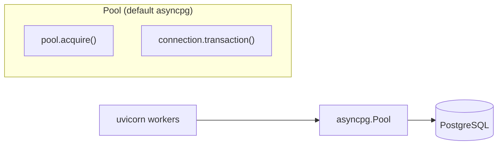

- Pool created once at startup via `init_db()`
- Services accept optional `conn` parameter for participation in caller's transaction
- `_db(conn)` helper returns passed connection or pool

## 5.6 Data Retention

No automated purge in production code. Demo/maintenance scripts exist under `backend/scripts/` for seed and cleanup.

---

# 6. API Architecture

## 6.1 API Style

- **REST** over HTTP/JSON
- Base path: `/api`
- **No GraphQL, no WebSockets, no gRPC**
- Idempotent reads; mutations return updated entity or 204

## 6.2 API Topology

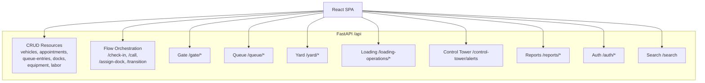

## 6.3 Request Headers

| Header | Required | Purpose |
|--------|----------|---------|
| `Content-Type` | On POST/PATCH | `application/json` |
| `X-YMS-Role` | Mutations | RBAC role (admin, operations, gate, supervisor, read_only) |
| `X-YMS-User` | Optional | Identity string for audit (`created_by`) |

## 6.4 Pagination

List endpoints support optional `skip` and `limit` query parameters:
- Without `limit`: returns JSON **array**
- With `limit`: returns `{ items, total, skip, limit }`
- Max limit: 500 (`LIST_PAGE_LIMIT` on frontend matches backend `MAX_PAGE_LIMIT`)

## 6.5 Error Contract

| Code | Meaning | Example |
|------|---------|---------|
| 400 | Bad request | Invalid transition target |
| 401 | Invalid role | Unknown X-YMS-Role |
| 403 | Permission denied | read_only attempting mutation |
| 404 | Not found | Vehicle not found |
| 409 | Business conflict | Duplicate booking_reference, resource gating failed |
| 422 | Schema validation | Pydantic field errors |

Resource gating 409 includes structured detail:
```json
{
  "detail": {
    "code": "RESOURCE_GATING_FAILED",
    "missing": ["labor"],
    "message": "..."
  }
}
```

## 6.6 OpenAPI

FastAPI auto-generates OpenAPI at `/docs` and `/redoc` when backend is running.

---

# 7. Event Architecture

## 7.1 Design Pattern

YARD.OS uses an **event-sourced audit log** pattern, not full event sourcing:
- **Write:** Every significant action appends a row to `yard_events`
- **Read:** Analytics, reports, loading progress, and alerts **derive** state from events + current entity tables
- **No event replay** engine exists — events supplement, not replace, operational tables

## 7.2 Event Record Schema

| Field | Type | Notes |
|-------|------|-------|
| `id` | UUID | Primary key |
| `vehicle_id` | UUID nullable | |
| `appointment_id` | UUID nullable | |
| `queue_entry_id` | UUID nullable | |
| `dock_id` | UUID nullable | |
| `equipment_id` | UUID nullable | |
| `labor_id` | UUID nullable | |
| `event_type` | TEXT | One of 62 defined types |
| `event_time` | TIMESTAMPTZ | Business timestamp |
| `event_note` | TEXT nullable | Human-readable context |
| `created_by` | TEXT | Actor (user header or system) |

## 7.3 Event Categories

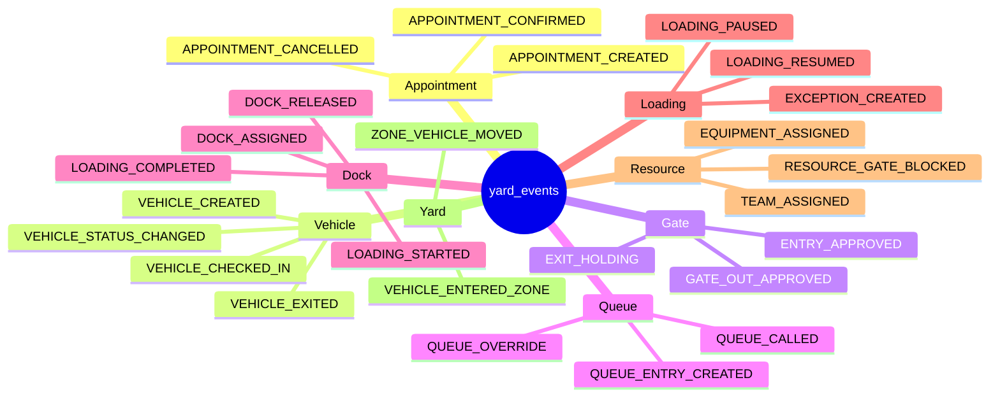

## 7.4 Event Emission Points

| Emitter | Function | When |
|---------|----------|------|
| `yms_service` | `create_yard_event()` | All CRUD and flow operations |
| `gate_service` | via `create_yard_event` | Entry/exit workflow |
| `loading_exceptions_service` | via `create_yard_event` | Exception lifecycle, pause/resume |
| `labor_service` / `equipment_service` | via `create_yard_event` | Assign/release |
| `yard_service` | via `create_yard_event` | Zone moves |

## 7.5 Event Consumers

| Consumer | Usage |
|----------|-------|
| `control_tower_alerts_service` | Stalled dock detection, loading progress |
| `operational_reports_service` | Delay analysis, SLA, utilization |
| `vehicle_journey_report_service` | Timeline reconstruction |
| `loadingProgressEngine.js` | Client-side ETA/health |
| `loadingPauseEngine.js` | Client-side pause state |
| Vehicle Drawer | Journey timeline display |

## 7.6 Control Tower Alerts (Derived Events)

Alerts are **not persisted** — computed on each `GET /control-tower/alerts` from live data + events. See Section 9.

---

# 8. Lifecycle Engine Architecture

## 8.1 Overview

The lifecycle engine enforces the vehicle status state machine defined in `enums.STATUS_TRANSITIONS`. All operational transitions flow through guarded service functions — never direct SQL status updates from routers.

## 8.2 State Machine

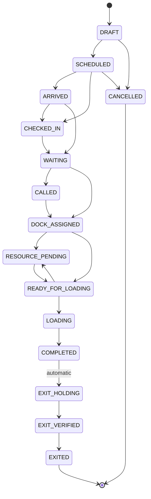

## 8.3 Transition Entry Points

| Transition | Entry Point | Guard |
|------------|-------------|-------|
| → ARRIVED | `gate_service.mark_arrived` | SCHEDULED/DRAFT |
| → WAITING | `gate_service.approve_entry` / `check_in_vehicle` | Entry checks pass |
| → CALLED | `yms_service.call_queue_entry` | Callable status |
| → DOCK_ASSIGNED | `yms_service.assign_dock` | Queue CALLED, dock AVAILABLE |
| → RESOURCE_PENDING / READY_FOR_LOADING | `sync_vehicle_readiness_status` | Auto after resource change |
| → LOADING | `transition_vehicle_status(LOADING)` | Resource gating pass |
| → COMPLETED | `transition_vehicle_status(COMPLETED)` | Must be LOADING |
| → EXIT_HOLDING | Automatic in COMPLETED handler | — |
| → EXIT_VERIFIED | `gate_service.verify_exit` | 7-check checklist |
| → EXITED | `gate_service.gate_out` | Must be EXIT_VERIFIED |

## 8.4 Core Function: `transition_vehicle_status`

Located in `yms_service.py`. Executes within a database transaction:

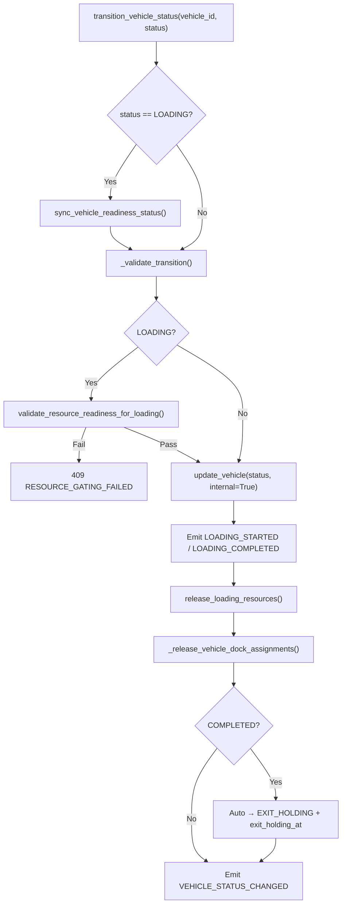

## 8.5 Lifecycle Guards

| Guard | Location | Rule |
|-------|----------|------|
| `_guard_direct_lifecycle_status_patch` | `yms_service` | Blocks operational status on PATCH |
| `_validate_transition` | `yms_service` | Enforces STATUS_TRANSITIONS graph |
| `FLOW_VEHICLE_TRANSITION_STATUSES` | `enums.py` | Flow API accepts only LOADING, COMPLETED, CANCELLED |
| `OPERATIONAL_LIFECYCLE_STATUSES` | `enums.py` | Full set blocked from direct PATCH |

## 8.6 Appointment-Vehicle Sync

On internal status updates, linked appointment and queue_entry statuses are synchronized to match vehicle status (within the same transaction).

---

# 9. Control Tower Architecture

## 9.1 Dual-Layer Design

| Layer | Implementation | Data Source |
|-------|----------------|-------------|
| **Dashboard UI** | `Dashboard.jsx` + `controlTowerApi.js` | Client-side parallel fetch of 8 list APIs |
| **Alerts API** | `control_tower_alerts_service.py` | Server-side derived computation |
| **TopNav badges** | `TopNav.jsx` polls alerts | Same alerts API |

There is **no** `/control-tower/dashboard` backend endpoint — KPI cards are computed in the browser.

## 9.2 Client Aggregation Flow

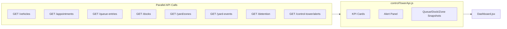

## 9.3 Alerts Engine

`get_control_tower_alerts()` in `control_tower_alerts_service.py`:

1. Fetches vehicles, appointments, queues, docks, events, labor, equipment, loading exceptions
2. Iterates vehicles by status applying threshold rules
3. Checks dock stall conditions
4. Evaluates queue congestion
5. Maps open exceptions to LOADING_EXCEPTION alerts
6. Sorts: CRITICAL first, then duration descending

### Alert Thresholds (configurable constants)

| Constant | Value | Alert Type |
|----------|-------|------------|
| `waiting_minutes` | 60 | VEHICLE_WAITING_TOO_LONG |
| `hazmat_waiting_minutes` | 30 | HAZMAT_SLA_BREACH |
| `exit_holding_minutes` | 30 | EXIT_HOLDING_DELAY |
| `dock_stalled_minutes` | 30 | DOCK_BLOCKED |
| `queue_congestion` | 10 | QUEUE_CONGESTION |
| dock `estimated_service_time_min` | 90 default | LOADING_DELAY |

## 9.4 Recommendations Layer

`aiInsightsApi.js` maps `alertType` → recommendation card. No ML — pure rule-based presentation of alerts data.

## 9.5 Canonical Metrics

Waiting and loading pipeline counts on Control Tower should align with `operational_metrics.py`:
- **Waiting** = `count_vehicles_waiting()` → status `WAITING` only
- **Loading pipeline** = `READY_FOR_LOADING` + `LOADING`

Operations Dashboard uses the same canonical functions server-side.

---

# 10. Loading Operations Architecture

## 10.1 Component Overview

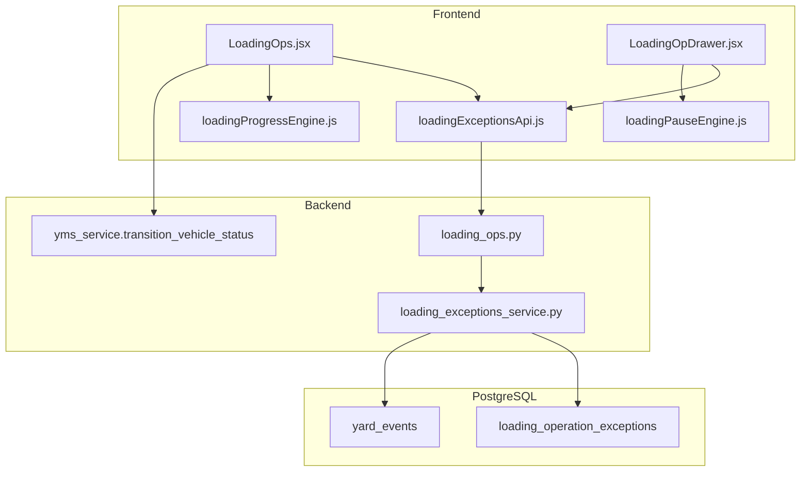

## 10.2 Exception Lifecycle

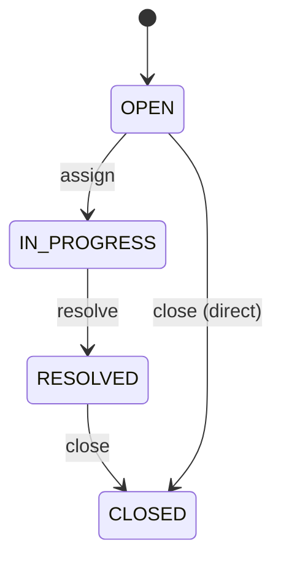

**Exception types:** MATERIAL_SHORTAGE, EQUIPMENT_FAILURE, LABOR_DELAY, DOCUMENTATION_HOLD, SAFETY_HOLD, QUALITY_HOLD, WEATHER_DELAY, GENERIC_DELAY

**Critical types:** EQUIPMENT_FAILURE, SAFETY_HOLD → CRITICAL severity in alerts

## 10.3 Pause / Resume

Pause does **not** change vehicle status (remains LOADING):
- `POST /loading-operations/pause` → `LOADING_PAUSED` yard event
- `POST /loading-operations/resume` → `LOADING_RESUMED` yard event
- `compute_pause_state()` derives current pause from latest pause/resume events

## 10.4 Loading Progress (Client)

`loadingProgressEngine.js` computes:
- `loading_started_at` from LOADING_STARTED event
- `estimated_duration_min` from dock.estimated_service_time_min (default 90)
- Health: ON_TIME (< 80% elapsed), AT_RISK (80–100%), DELAYED (> 100%)
- ETA clock from started_at + estimated duration

## 10.5 Resource Gating Integration

Before `transition_vehicle_status(LOADING)`:
1. `sync_vehicle_readiness_status` promotes DOCK_ASSIGNED/RESOURCE_PENDING → READY_FOR_LOADING if resources available
2. `validate_resource_readiness_for_loading` checks dock + labor (equipment optional)
3. On failure: `RESOURCE_GATE_BLOCKED` event + HTTP 409

---

# 11. Reporting Architecture

## 11.1 Report Topology

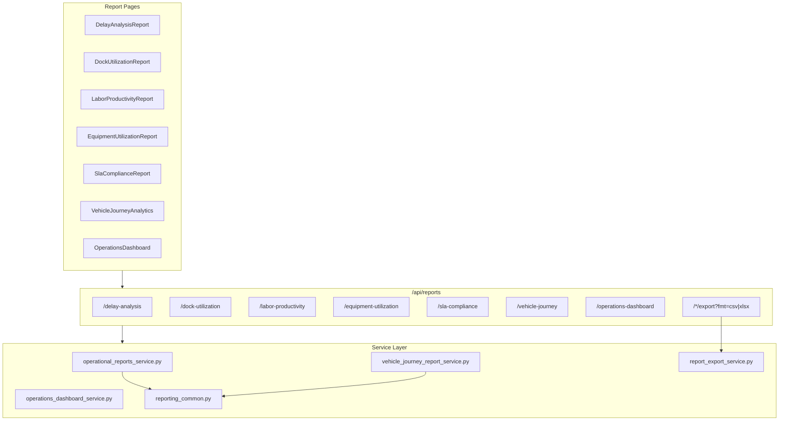

## 11.2 Data Sources

All reports query **live database state** — no materialized views, caches, or OLAP store.

| Report | Primary Inputs |
|--------|----------------|
| Operations Dashboard | vehicles, appointments, queues, docks, events, detention |
| Delay Analysis | yard_events, exceptions, vehicle timestamps |
| Dock Utilization | docks, events (DOCK_ASSIGNED/RELEASED, LOADING_*) |
| Labor Productivity | labor_teams, events (TEAM_ASSIGNED/RELEASED) |
| Equipment Utilization | equipment, events (EQUIPMENT_ASSIGNED/RELEASED) |
| SLA Compliance | journey milestones from events vs REPORT_SLA thresholds |
| Vehicle Journey | Full event timeline per vehicle |

## 11.3 Shared Reporting Utilities

`reporting_common.py` provides:
- `journey_milestone_times()` — extract check-in, called, loading, exit timestamps
- `minutes_between()`, `event_in_range()`, `filter_events_by_range()`
- `REPORT_SLA` constants for SLA thresholds

## 11.4 Export Pipeline

`report_export_service.py` → `export_response()`:
- Formats: CSV, XLSX (openpyxl)
- Content-Disposition attachment headers
- Used by 5 `/export` endpoints

## 11.5 Client vs Server Reports

| Report | Computation Location |
|--------|---------------------|
| Operations Dashboard | **Server** (`operations_dashboard_service`) |
| Delay, Dock, Labor, Equipment, SLA, Journey | **Server** (`operational_reports_service`) |
| Executive KPIs | **Client** (`executiveKpisApi.js`) |
| Control Tower KPIs | **Client** (`controlTowerApi.js`) |

---

# 12. Cross-Module Synchronization Architecture

## 12.1 Backend Synchronization

Cross-module consistency is achieved through **synchronous orchestration in service layer transactions**, not async messaging.

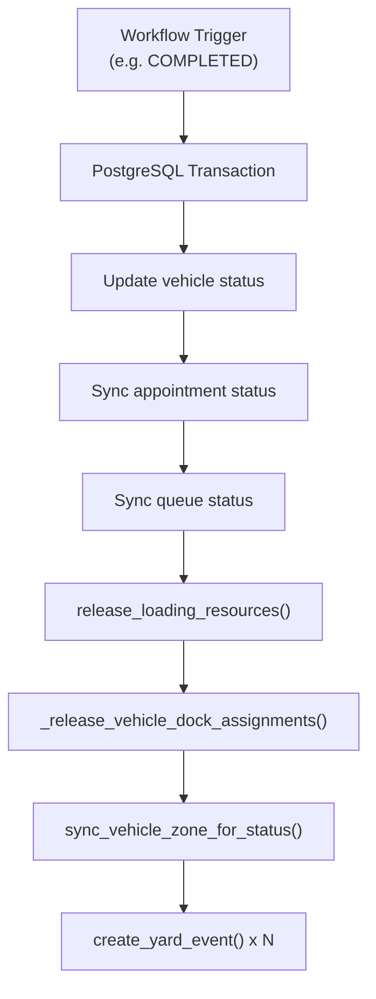

### Synchronization Rules

| ID | Trigger | Side Effects |
|----|---------|--------------|
| SYNC-001 | `transition_vehicle_status(COMPLETED)` | Release labor/equipment, release dock, auto EXIT_HOLDING, set exit_holding_at |
| SYNC-002 | Exit lifecycle transitions | `_release_vehicle_dock_assignments` |
| SYNC-003 | Labor/equipment assign/release | `sync_vehicle_readiness_status` |
| SYNC-004 | Dock assign | Vehicle DOCK_ASSIGNED, dock OCCUPIED, readiness sync |
| SYNC-005 | Gate check-in | Queue entry, vehicle WAITING, priority_score, zone → WAITING_AREA |
| SYNC-006 | Appointment CANCELLED | Vehicle CANCELLED if applicable |
| SYNC-007 | Status transition | `sync_vehicle_zone_for_status` auto zone placement |

## 12.2 Frontend Synchronization

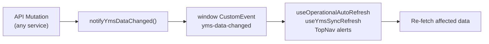

**Poll fallback:** `OPERATIONAL_POLL_MS = 30_000` ensures views converge even if event is missed.

## 12.3 Entity Sync Matrix

| Primary Entity | Synced Entities on Change |
|----------------|---------------------------|
| Vehicle status | Appointment, queue_entry, zone_id |
| Dock assignment | Dock status, queue dock_id, vehicle status |
| Labor assign | Vehicle readiness, yard_event |
| Equipment assign | Vehicle readiness (informational), yard_event |
| Gate check-in | Vehicle, appointment, queue, zone |

## 12.4 Reconciliation

`scripts/reconcile_stale_dock_occupancy.py` — maintenance script to fix dock OCCUPIED without active vehicle (orphan state). Not automated in runtime.

---

# 13. Role-Based Access Architecture

## 13.1 Model

RBAC is **header-based** for development/demo. No JWT, OAuth, or session cookies.

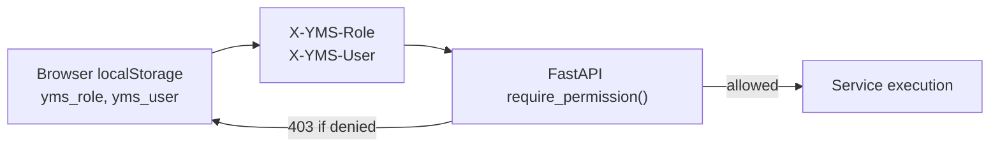

## 13.2 Roles

| Role | Description |
|------|-------------|
| `admin` | Full access (`*` permission) |
| `operations` | Full operational workflow except detention |
| `gate` | Gate, check-in, limited writes |
| `supervisor` | Call, assign dock, detention, queue override |
| `read_only` | View only — all mutations blocked |

## 13.3 Permission Enforcement

**Backend:** `auth_rbac.require_permission(PERM_*)` FastAPI dependency on mutation routes.

**Frontend:** `usePermissions()` hook → `can(permission)` hides/disables buttons in:
- Gate, Queue, Docks, Loading, Labor, Equipment, Appointments
- ExitVerificationDrawer, DockDrawer, LoadingOpDrawer, TopNav

## 13.4 Permission Catalog

12 permission strings: `vehicle.write`, `appointment.write`, `queue.write`, `dock.write`, `flow.check_in`, `flow.call`, `flow.assign_dock`, `flow.vehicle_transition`, `detention.write`, `equipment.write`, `labor.write`, `yard_event.write`, `yard_zone.write`

Full matrix: see `auth_rbac.py` → `ROLE_PERMISSIONS`.

---

# 14. Docker Deployment Architecture

## 14.1 Compose Services

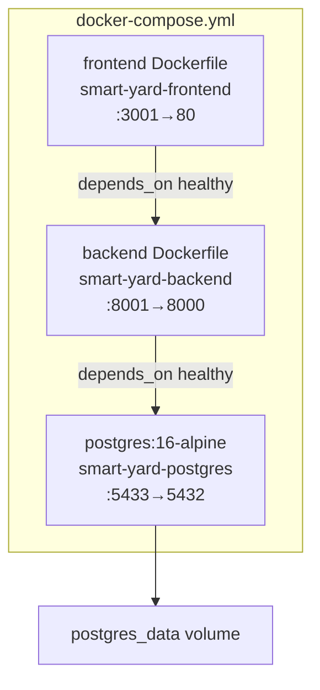

## 14.2 Service Configuration

| Service | Image Build | Ports | Health Check |
|---------|-------------|-------|--------------|
| postgres | `postgres:16-alpine` | 5433:5432 | `pg_isready` |
| backend | `backend/Dockerfile` | 8001:8000 | HTTP GET `/api/` |
| frontend | `frontend_1/Dockerfile` | 3001:80 | — (nginx static) |

## 14.3 Backend Container

- Base: `python:3.11-slim`
- Dependencies: `requirements.docker.txt`
- CMD: `uvicorn server:app --host 0.0.0.0 --port 8000`
- Env: `DATABASE_URL`, `CORS_ORIGINS`

## 14.4 Frontend Container

Multi-stage build:
1. **Build stage:** `node:22-alpine` → `npm ci` → `npm run build` (CRA)
2. **Production stage:** `nginx:1.27-alpine` serves `/app/build`
- Build arg: `REACT_APP_API_BASE_URL=http://localhost:8001/api`
- SPA routing: `try_files $uri /index.html`

## 14.5 Network Model

All services on default Docker Compose network. Browser accesses:
- UI: `http://localhost:3001`
- API: `http://localhost:8001/api` (direct from browser, not proxied through nginx)

## 14.6 Startup Sequence

```mermaid
sequenceDiagram
    participant DC as Docker Compose
    participant PG as PostgreSQL
    participant BE as Backend
    participant FE as Frontend

    DC->>PG: Start postgres
    PG-->>DC: Healthy (pg_isready)
    DC->>BE: Start backend
    BE->>PG: init_db() + create_schema()
    BE-->>DC: Healthy (GET /api/)
    DC->>FE: Start frontend (nginx)
    FE-->>DC: Serving static build
```

## 14.7 Development Variant

`docker-compose.dev.yml` available for development overrides (hot reload configurations).

---

# 15. Data Flow Diagrams

## 15.1 Vehicle Visit — End-to-End Data Flow

```mermaid
flowchart TD
    subgraph Schedule["Scheduling"]
        Book["POST /appointments"]
        V1["vehicles: SCHEDULED"]
        A1["appointments: SCHEDULED"]
    end

    subgraph GateIn["Gate Entry"]
        Lookup["POST /gate/lookup"]
        Approve["POST /gate/approve-entry"]
        V2["vehicles: WAITING"]
        Q1["queue_entries: WAITING"]
    end

    subgraph Queue["Virtual Queue"]
        Call["POST /flow/.../call"]
        V3["vehicles: CALLED"]
    end

    subgraph Dock["Dock Assignment"]
        Assign["POST /flow/.../assign-dock"]
        V4["vehicles: DOCK_ASSIGNED"]
        D1["docks: OCCUPIED"]
    end

    subgraph Resources["Resource Gating"]
        Labor["POST /labor/{id}/assign"]
        V5["vehicles: READY_FOR_LOADING"]
    end

    subgraph Loading["Loading"]
        Start["POST /flow/.../transition LOADING"]
        Complete["POST /flow/.../transition COMPLETED"]
        V6["vehicles: EXIT_HOLDING"]
    end

    subgraph GateOut["Gate Exit"]
        Verify["POST /gate/.../verify-exit"]
        Out["POST /gate/.../gate-out"]
        V7["vehicles: EXITED"]
    end

    Book --> V1
    Book --> A1
    Lookup --> Approve
    Approve --> V2
    Approve --> Q1
    Call --> V3
    Assign --> V4
    Assign --> D1
    Labor --> V5
    Start --> Complete
    Complete --> V6
    Verify --> Out
    Out --> V7
```

## 15.2 KPI Data Flow

```mermaid
flowchart LR
    subgraph Sources["Operational Tables"]
        V["vehicles"]
        Q["queue_entries"]
        D["docks"]
        E["yard_events"]
    end

    subgraph Canonical["operational_metrics.py"]
        CW["count_vehicles_waiting()"]
        CL["count_loading_pipeline()"]
        CE["count_exit_holding()"]
    end

    subgraph Consumers["Consumers"]
        OpsDash["Operations Dashboard\n(server)"]
        GateKPI["Gate Dashboard\n(server)"]
        CT["Control Tower\n(client recompute)"]
        Exec["Executive KPIs\n(client recompute)"]
    end

    V --> Canonical
    Q --> Canonical
    D --> Canonical
    Canonical --> OpsDash
    Canonical --> GateKPI
    V --> CT
    V --> Exec
```

## 15.3 Report Data Flow

```mermaid
flowchart TD
    DB[(PostgreSQL)]
    Events["yard_events"]
    Entities["Entity tables"]

    DB --> Events
    DB --> Entities

    Events --> RC["reporting_common.py"]
    Entities --> ORS["operational_reports_service.py"]
    RC --> ORS
    ORS --> API["GET /reports/*"]
    API --> UI["Report Pages"]
    ORS --> Export["report_export_service.py"]
    Export --> File["CSV / XLSX download"]
```

---

# 16. Sequence Diagrams

## 16.1 Gate Entry Sequence

```mermaid
sequenceDiagram
    actor Operator
    participant UI as Gate.jsx
    participant API as gate_service
    participant YMS as yms_service
    participant DB as PostgreSQL

    Operator->>UI: Enter plate / scan
    UI->>API: POST /gate/lookup
    API->>DB: Find vehicle + appointment
    API-->>UI: Entry checks (6 items)

    Operator->>UI: Approve Entry
    UI->>API: POST /gate/vehicles/{id}/approve-entry
    API->>API: Validate all 6 checks
    API->>YMS: check_in_vehicle()
    YMS->>DB: BEGIN TRANSACTION
    YMS->>DB: vehicle → WAITING
    YMS->>DB: INSERT queue_entry
    YMS->>DB: INSERT yard_events
    YMS->>DB: zone → WAITING_AREA
    YMS->>DB: COMMIT
    YMS-->>UI: Success
    UI->>UI: notifyYmsDataChanged()
```

## 16.2 Dock Assignment and Loading Sequence

```mermaid
sequenceDiagram
    actor Ops as Operator
    participant UI as Docks.jsx
    participant YMS as yms_service
    participant RG as resource_gating_service
    participant DB as PostgreSQL

    Ops->>UI: Assign dock to CALLED vehicle
    UI->>YMS: POST /flow/.../assign-dock
    YMS->>DB: dock → OCCUPIED, vehicle → DOCK_ASSIGNED
    YMS->>RG: sync_vehicle_readiness_status()
    RG-->>YMS: RESOURCE_PENDING (no labor)

    Ops->>UI: Assign labor team
    UI->>YMS: POST /labor/{id}/assign
    YMS->>RG: sync_vehicle_readiness_status()
    RG-->>YMS: READY_FOR_LOADING

    Ops->>UI: Start Loading
    UI->>YMS: POST /flow/.../transition {LOADING}
    YMS->>RG: validate_resource_readiness_for_loading()
    RG-->>YMS: ready=true
    YMS->>DB: vehicle → LOADING, LOADING_STARTED event

    Ops->>UI: Complete Loading
    UI->>YMS: POST /flow/.../transition {COMPLETED}
    YMS->>DB: release resources, release dock
    YMS->>DB: vehicle → EXIT_HOLDING (auto)
    YMS->>DB: LOADING_COMPLETED, EXIT_HOLDING events
```

## 16.3 Control Tower Alert Refresh Sequence

```mermaid
sequenceDiagram
    participant TopNav
    participant Dashboard
    participant API as control_tower_alerts_service
    participant DB as PostgreSQL

    par Every 30 seconds
        TopNav->>API: GET /control-tower/alerts
        Dashboard->>API: GET /control-tower/alerts
    end

    API->>DB: Fetch vehicles, queues, docks, events, labor, equipment, exceptions
    API->>API: Apply threshold rules
    API-->>TopNav: {criticalCount, warningCount, activeAlerts}
    API-->>Dashboard: Same alerts bundle
```

## 16.4 Loading Exception Sequence

```mermaid
sequenceDiagram
    actor Sup as Supervisor
    participant UI as LoadingOpDrawer
    participant API as loading_exceptions_service
    participant DB as PostgreSQL

    Sup->>UI: Raise exception
    UI->>API: POST /loading-operations/exceptions
    API->>DB: INSERT exception (OPEN)
    API->>DB: INSERT EXCEPTION_CREATED event
  API-->>UI: ExceptionOut

    Sup->>UI: Assign exception
    UI->>API: POST /exceptions/{id}/assign
    API->>DB: status → IN_PROGRESS

    Sup->>UI: Resolve
    UI->>API: POST /exceptions/{id}/resolve
    API->>DB: status → RESOLVED

    Sup->>UI: Close
    UI->>API: POST /exceptions/{id}/close
    API->>DB: status → CLOSED
```

---

# 17. Integration Architecture

## 17.1 Current Integration Points

| Integration | Status | Mechanism |
|-------------|--------|-----------|
| Browser UI ↔ API | **Implemented** | REST/JSON over HTTP |
| Gate scan | **Stub** | `POST /gate/scan` + `gateScanner.js` provider pattern |
| Global search | **Implemented** | `GET /search?q=` |
| PDF export (Control Tower) | **Client-only** | `dailyReport.js` |
| Report export | **Implemented** | `GET /reports/*/export` |

## 17.2 Integration Topology

```mermaid
flowchart TB
    subgraph Internal["Implemented"]
        SPA["React SPA"]
        API["FastAPI"]
        DB[(PostgreSQL)]
    end

    subgraph External["External (Current / Future)"]
        ANPR["ANPR Camera"]
        QR["QR Scanner"]
        RFID["Gate Pass RFID"]
        ERP["ERP System"]
        Fleet["Fleet Management"]
    end

    SPA <-->|REST| API
    API <--> DB
    ANPR -.->|Future| API
    QR -.->|Provider hook| SPA
    RFID -.->|Future| API
    ERP -.->|Future| API
    Fleet -.->|Future| API
```

## 17.3 Gate Scan API (Foundation)

`POST /api/gate/scan` accepts:
```json
{ "query": "MH12AB1234", "scan_type": "QR|ANPR|GATE_PASS", "gate_id": "G1" }
```

Returns lookup result via `gate_service.lookup_vehicle()`. Frontend `gateScanner.js` abstracts hardware — mock providers return after 800ms delay.

## 17.4 No Current External Integrations

The platform operates as a **standalone system**. No webhooks, message queues, or external API consumers are implemented.

---

# 18. Security Architecture

## 18.1 Security Model (As Implemented)

| Layer | Control | Status |
|-------|---------|--------|
| Transport | HTTPS | **Not enforced** in Docker dev (HTTP only) |
| Authentication | Header role | **Demo-grade** — no password/OAuth |
| Authorization | RBAC permissions | **Implemented** on all mutations |
| Input validation | Pydantic schemas | **Implemented** |
| SQL injection | Parameterized queries (asyncpg) | **Implemented** |
| CORS | Configurable origins | **Implemented** |
| Secrets | Docker env vars | **Dev credentials** in compose file |

## 18.2 Threat Considerations

```mermaid
flowchart TD
    subgraph Mitigated["Mitigated (Dev Scope)"]
        RBAC["RBAC on mutations"]
        Validation["Schema validation"]
        SQL["Parameterized SQL"]
        Lifecycle["Status transition guards"]
    end

    subgraph Gaps["Production Gaps"]
        Auth["No real authentication"]
        TLS["No TLS in default compose"]
        Secrets["Hardcoded DB password"]
        Audit["No tamper-proof audit"]
        Rate["No rate limiting"]
    end
```

## 18.3 RBAC as Primary Security Control

In the current deployment, **role header is the sole access control**. Production deployment must replace this with:
- JWT or session-based authentication
- Role claims embedded in signed token
- HTTPS termination at reverse proxy

## 18.4 Data Protection

- No PII encryption at rest
- No field-level encryption
- Driver phone stored in plain text
- Database accessible on port 5433 in dev compose

## 18.5 CORS Policy

`CORS_ORIGINS` environment variable (comma-separated). Docker default: `http://localhost:3001`. Wildcard `*` possible via env but not recommended for production.

---

# 19. Scalability Considerations

## 19.1 Current Architecture Limits

| Aspect | Current State | Limit |
|--------|---------------|-------|
| API instances | Single uvicorn process | No horizontal scaling |
| Database | Single PostgreSQL instance | Write bottleneck |
| Caching | None | Every request hits DB |
| Event processing | Synchronous | Alert/report compute on read |
| Frontend data | Full list fetch (limit 500) | Large yards need pagination UX |
| WebSockets | None | 30s polling for freshness |

## 19.2 Scaling Dimensions

```mermaid
quadrantChart
    title Scaling Priority Matrix
    x-axis Low Effort --> High Effort
    y-axis Low Impact --> High Impact
    quadrant-1 Plan Carefully
    quadrant-2 Do First
    quadrant-3 Deprioritize
    quadrant-4 Quick Wins
    Connection Pool Tuning: [0.2, 0.4]
    Read Replicas: [0.6, 0.7]
    Redis Cache: [0.4, 0.6]
    Horizontal API: [0.5, 0.8]
    WebSocket Push: [0.7, 0.5]
    Report Materialized Views: [0.6, 0.6]
    Microservices Split: [0.9, 0.3]
```

## 19.3 Recommended Evolution Path

1. **Short term:** Connection pool tuning, database indexes on `yard_events(vehicle_id, event_time)`, report date-range defaults
2. **Medium term:** Redis cache for Control Tower alerts, read replica for reports, WebSocket for live updates
3. **Long term:** Separate analytics store (event stream → warehouse), API gateway with rate limiting

## 19.4 Multi-Yard Considerations

Current schema has **no tenant_id** — single-yard deployment only. Multi-yard would require:
- Tenant column on all master tables
- Row-level security or schema-per-tenant
- Tenant context in API headers

---

# 20. Future OCR Architecture

## 20.1 Current State

Gate identification today supports:
- Manual plate / booking reference entry
- Mock QR, ANPR, gate-pass scanners via `gateScanner.js` provider registration
- `POST /gate/scan` API accepting pre-processed query strings

**No OCR/ANPR processing occurs server-side.**

## 20.2 Target Architecture

```mermaid
flowchart LR
    subgraph Edge["Gate Edge Layer"]
        Cam["ANPR Camera"]
        OCR["OCR Service\n(plate recognition)"]
        QR["QR Scanner"]
        RFID["RFID Reader"]
    end

    subgraph Integration["Integration Layer"]
        Adapter["Gate Hardware Adapter"]
        Queue["Scan Event Queue\n(Optional)"]
    end

    subgraph YARDOS["YARD.OS"]
        ScanAPI["POST /gate/scan"]
        Lookup["gate_service.lookup"]
    end

    Cam --> OCR
    OCR --> Adapter
    QR --> Adapter
    RFID --> Adapter
    Adapter --> Queue
    Queue --> ScanAPI
    Adapter --> ScanAPI
    ScanAPI --> Lookup
```

## 20.3 Proposed Components

| Component | Responsibility |
|-----------|----------------|
| **ANPR Service** | Camera stream → plate text → confidence score |
| **OCR Validation** | Format rules per region (e.g. Indian plate patterns) |
| **Hardware Adapter** | Normalize device outputs to `ScanResult` type |
| **Frontend Provider** | Replace mock in `setANPRScannerProvider()` |
| **Scan Audit** | `GATE_SCAN` event with raw payload reference |

## 20.4 Integration Pattern

Extend `gateScanner.js` pattern to server-side:

```javascript
// Frontend — register real provider
setANPRScannerProvider(async () => {
  const res = await fetch(`${ANPR_SERVICE}/recognize`);
  const { plate, confidence } = await res.json();
  if (confidence < 0.85) throw new Error("Low confidence scan");
  return { query: plate, scanType: "ANPR", raw: JSON.stringify(res) };
});
```

Server-side alternative: ANPR service calls `POST /gate/scan` directly with service account role `gate`.

## 20.5 Data Flow (Future)

```mermaid
sequenceDiagram
    participant Cam as ANPR Camera
    participant OCR as OCR Microservice
    participant API as POST /gate/scan
    participant Gate as gate_service
    participant UI as Gate.jsx

    Cam->>OCR: Image frame
    OCR->>OCR: Recognize plate
    OCR->>API: {query, scan_type: ANPR, confidence}
    API->>Gate: lookup_vehicle(query)
    Gate-->>API: Vehicle + entry checks
    API-->>UI: Push via WebSocket (future) or poll
```

---

# 21. Future ERP/Fleet Integration Architecture

## 21.1 Current State

No ERP or fleet management integration exists. Appointments and vehicles are created within YARD.OS via UI or seed scripts.

## 21.2 Integration Goals

| System | Data Exchange |
|--------|---------------|
| **ERP** | Inbound appointments, outbound completion confirmations, detention charges |
| **Fleet Management** | Vehicle master sync, driver assignments, GPS arrival triggers |
| **TMS** | Shipment references, carrier contracts, SLA definitions |

## 21.3 Target Architecture

```mermaid
flowchart TB
    subgraph External["External Systems"]
        ERP["ERP\n(SAP / Oracle / Custom)"]
        Fleet["Fleet Management"]
        TMS["Transportation Management"]
    end

    subgraph IntegrationHub["Integration Hub (Future)"]
        GW["API Gateway"]
        ESB["Event Bus\n(Kafka / RabbitMQ)"]
        Transform["Schema Transform\n(ERP ↔ YMS)"]
        Scheduler["Sync Scheduler"]
    end

    subgraph YARDOS["YARD.OS"]
        Inbound["Inbound API\n/integrations/appointments"]
        Outbound["Outbound Webhooks\n/integrations/events"]
        Core["Core YMS Services"]
    end

    ERP <--> GW
    Fleet <--> GW
    TMS <--> GW
    GW <--> Transform
    Transform <--> ESB
    ESB <--> Inbound
    ESB <--> Outbound
    Inbound --> Core
    Core --> Outbound
```

## 21.4 Proposed Integration Events

| Direction | Event | YMS Action |
|-----------|-------|------------|
| Inbound | `appointment.created` | Create vehicle + appointment |
| Inbound | `appointment.cancelled` | Cancel appointment + vehicle |
| Inbound | `vehicle.master.updated` | PATCH vehicle registry |
| Outbound | `vehicle.checked_in` | Notify ERP of arrival |
| Outbound | `loading.completed` | Shipment ready signal |
| Outbound | `vehicle.exited` | Close transport order |
| Outbound | `detention.approved` | Post charge to ERP |

## 21.5 API Extensions (Proposed)

| Endpoint | Purpose |
|----------|---------|
| `POST /integrations/appointments` | Bulk/import appointment with API key auth |
| `POST /integrations/vehicles` | Fleet master sync |
| `GET /integrations/events` | Polling endpoint for outbound events |
| `POST /webhooks/register` | Register ERP callback URL |

## 21.6 Sync Strategies

| Strategy | Use Case |
|----------|----------|
| **Real-time webhook** | Appointment creation, cancellation |
| **Polling** | ERP without push capability |
| **Batch (nightly)** | Vehicle master reconciliation |
| **Event outbox** | Guaranteed delivery to ERP (requires new `integration_outbox` table) |

## 21.7 Mapping Considerations

| YMS Field | ERP Equivalent |
|-----------|----------------|
| `booking_reference` | Transport order / delivery number |
| `shipment_reference` | Shipment / handling unit |
| `customer_name` | Ship-to party |
| `vehicle_number` | Fleet asset / license plate |
| `detention_records.cost` | Accounts payable line item |

## 21.8 Security for Integrations

- API key or mTLS for system-to-system auth (replacing header RBAC)
- Idempotency keys on inbound creates (prevent duplicate appointments)
- Event signing (HMAC) on outbound webhooks
- Separate `integration` role with minimal permissions

---

# Appendices

## Appendix A — File Reference

| Layer | Key Files |
|-------|-----------|
| Entry | `backend/server.py`, `frontend_1/src/App.js` |
| Lifecycle | `backend/enums.py`, `backend/services/yms_service.py` |
| Resource gating | `backend/services/resource_gating_service.py` |
| Events | `backend/services/yms_service.py` → `create_yard_event()` |
| Alerts | `backend/services/control_tower_alerts_service.py` |
| Metrics | `backend/services/operational_metrics.py` |
| Schema | `backend/db.py`, `backend/schemas.py` |
| RBAC | `backend/auth_rbac.py`, `frontend_1/src/hooks/usePermissions.js` |
| Sync | `frontend_1/src/services/ymsSync.js` |
| Deploy | `docker-compose.yml`, `backend/Dockerfile`, `frontend_1/Dockerfile` |

## Appendix B — Port Reference

| Service | Host Port | Container Port |
|---------|-----------|----------------|
| Frontend (nginx) | 3001 | 80 |
| Backend (uvicorn) | 8001 | 8000 |
| PostgreSQL | 5433 | 5432 |

## Appendix C — Related Documents

| Document | Purpose |
|----------|---------|
| `YMS_Functional_Requirements_Specification.md` | Functional behavior per module |
| `YMS_Business_Requirements_Document.md` | Business rules and stakeholder requirements |
| `YMS_Project_Overview.md` | Executive summary |
| `API_INVENTORY.md` | Complete API reference |
| `DATA_MODEL_ERD.md` | Entity relationship detail |
| `ROUTE_INVENTORY.md` | Frontend route map |

---

# Conclusion

YARD.OS is architected as a **monolithic three-tier web application** with a clear service-layer separation in the backend and a modular page/service structure in the frontend. Cross-module consistency is achieved through **database transactions** and a shared **yard_events audit log**, with browser-side polling and custom events for UI freshness.

The architecture is optimized for **single-yard operational deployment** with Docker Compose. Production hardening (real authentication, TLS, caching, horizontal scaling) and external integrations (OCR/ANPR, ERP, fleet) are documented as evolution paths in Sections 19–21.

**Implementation baseline:** React 19 + FastAPI + PostgreSQL 16, 3-container Docker stack, 122+ backend tests, 16 operational modules, 62 audit event types.
